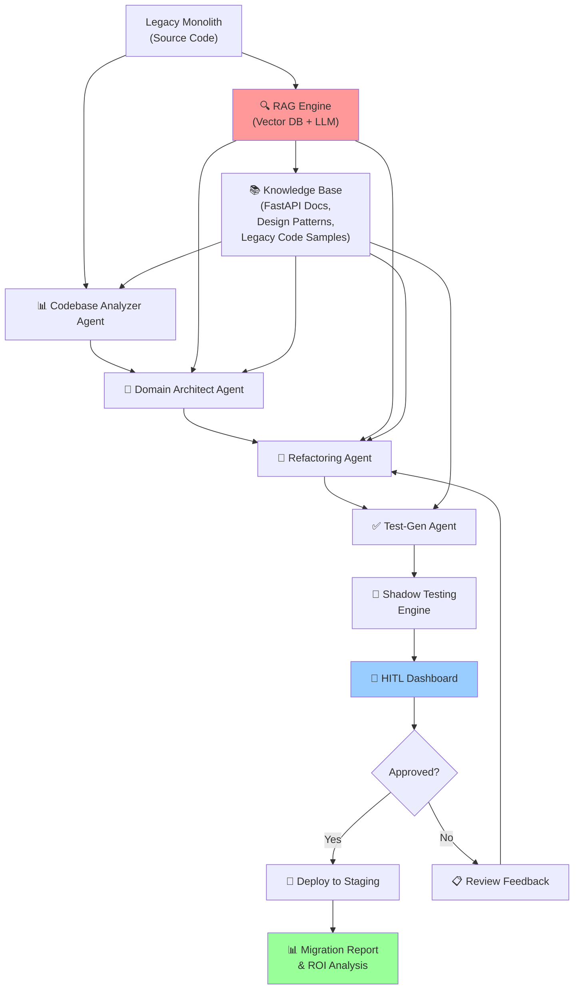

# Agentic Software Architecture Migration Assistant — Implementation Plan

## Executive Summary

Build an **autonomous, AI-powered system** that migrates legacy monolithic codebases to modern microservices architectures (FastAPI) using a multi-agent orchestration framework with Retrieval-Augmented Generation (RAG), automated testing, and human-in-the-loop governance. This plan reduces architecture migration timelines from **months to weeks** while maintaining 100% functional parity.

---

## Architecture Overview



---

## Project Structure

```
ArchitectureMigrationAssistant/
│
├── 📁 core/
│   ├── __init__.py
│   ├── orchestrator.py              # Main agentic loop & LangGraph workflow
│   ├── config.py                    # Configuration, model endpoints, safety settings
│   └── constants.py                 # Agent roles, prompt templates, tool definitions
│
├── 📁 agents/
│   ├── __init__.py
│   ├── analyzer_agent.py            # Codebase parsing & AST analysis
│   ├── architect_agent.py           # Domain-Driven Design & microservice boundaries
│   ├── refactoring_agent.py         # FastAPI code generation & transformation
│   ├── test_gen_agent.py            # Unit & integration test generation
│   └── supervisor_agent.py          # Workflow orchestration & approval routing
│
├── 📁 rag/
│   ├── __init__.py
│   ├── vector_store.py              # Pinecone/Weaviate integration & embedding
│   ├── knowledge_base.py            # Document loaders & indexing pipeline
│   ├── retriever.py                 # Context-aware retrieval for agents
│   └── embedder.py                  # Text embedding generation (OpenAI/Ollama)
│
├── 📁 tools/
│   ├── __init__.py
│   ├── code_analysis.py             # AST parsing, dependency mapping, metrics
│   ├── code_generation.py           # FastAPI template rendering, Pydantic model gen
│   ├── git_ops.py                   # Clone, branch, commit, PR operations
│   ├── testing.py                   # pytest runner, coverage analysis, shadow testing
│   └── llm_utils.py                 # Prompting utilities, context window management
│
├── 📁 safety/
│   ├── __init__.py
│   ├── sandbox.py                   # Code execution sandbox, blocklists
│   ├── validator.py                 # Syntax validation, security scanning (Bandit)
│   └── approval_engine.py           # HITL workflow & human approval tracking
│
├── 📁 ui/
│   ├── __init__.py
│   ├── dashboard.py                 # Streamlit web UI for monitoring
│   ├── project_manager.py           # Work Breakdown Structure (WBS) display
│   └── terminal.py                  # Rich terminal UI for CLI interaction
│
├── 📁 storage/
│   ├── __init__.py
│   ├── project_db.py                # SQLite/PostgreSQL for project metadata
│   ├── cache.py                     # Redis caching for agent context
│   └── audit_logger.py              # Comprehensive logging & audit trail
│
├── 📁 examples/
│   ├── sample_monolith/             # Test legacy codebase (Flask app)
│   ├── expected_output/             # Reference FastAPI microservices
│   └── test_cases.py                # Unit tests for the migration system
│
├── 📁 docs/
│   ├── architecture.md              # System design documentation
│   ├── agent_prompts.md             # Detailed prompt engineering guide
│   ├── rag_strategy.md              # RAG pipeline & knowledge base design
│   └── safety_framework.md          # Security & approval workflows
│
├── requirements.txt                 # Python dependencies
├── .env.example                     # Environment template
├── docker-compose.yml               # Local Pinecone/Weaviate + Redis
├── main.py                          # CLI entry point
└── README.md                        # Quick start guide
```

---

## Core Components

### 1. **Orchestrator & LangGraph Workflow** (`core/orchestrator.py`)

The multi-agent workflow engine coordinating all phases of migration:

```python
# Pseudo-code: LangGraph state machine
State = {
    "project_id": str,
    "source_code": str,              # Raw legacy codebase
    "dependency_graph": dict,        # Analyzer output
    "microservice_boundaries": list, # Architect output
    "generated_services": dict,      # Refactoring output
    "test_suite": dict,              # Test-Gen output
    "shadow_test_results": dict,     # Parity validation
    "human_approvals": list,         # HITL sign-offs
    "iteration_count": int
}

Graph = {
    "analyze_codebase": analyzer_agent,
    "design_architecture": architect_agent,
    "refactor_to_fastapi": refactoring_agent,
    "generate_tests": test_gen_agent,
    "run_shadow_tests": shadow_testing_pipeline,
    "request_approval": hitl_checkpoint,
    "deploy_or_retry": conditional_router
}
```

**Key Features:**
- Stateful workflow with persistent graph storage
- Built-in retry logic with exponential backoff
- Token budget management across long-running migrations
- Streaming logs to UI dashboard in real-time

---

### 2. **Analyzer Agent** (`agents/analyzer_agent.py`)

Autonomous parsing of legacy monolithic code:

**Responsibilities:**
- Parse Python/Java/C# AST to extract function calls, class hierarchies
- Map global variables, database queries, external API calls
- Generate dependency graph (nodes = functions/classes, edges = calls)
- Identify circular dependencies and coupling hotspots
- Calculate complexity metrics (cyclomatic complexity, lines of code)

**RAG Integration:**
- Retrieve similar legacy code patterns from knowledge base
- Fetch best-practice analysis templates
- Use embeddings to find analogous refactoring patterns

**Tool Arsenal:**
- `ast.parse()` for Python; `javalang`, `Roslyn` for Java/C#
- Neo4j or NetworkX for graph algorithms
- Radon library for code metrics

**Output Format:**
```json
{
  "codebase_stats": {
    "total_files": 342,
    "total_lines": 150000,
    "languages": ["python", "sql"],
    "cyclomatic_complexity_avg": 8.2
  },
  "dependency_graph": {
    "nodes": [
      {"id": "user_service.authenticate", "type": "function", "metrics": {...}},
      {"id": "database.query_user", "type": "db_call", "external": true}
    ],
    "edges": [
      {"from": "authenticate", "to": "query_user", "call_count": 15}
    ]
  },
  "coupling_hotspots": [
    {"module": "payment", "coupled_to": 8, "severity": "HIGH"},
    {"module": "auth", "coupled_to": 5, "severity": "MEDIUM"}
  ],
  "external_dependencies": ["stripe", "sendgrid", "postgres"]
}
```

---

### 3. **Domain Architect Agent** (`agents/architect_agent.py`)

Proposes logical microservice boundaries using Domain-Driven Design:

**Responsibilities:**
- Cluster tightly-coupled modules into bounded contexts
- Define service APIs (input/output contracts)
- Map database schemas to service ownership
- Propose API gateway routing rules
- Identify inter-service communication patterns (sync vs. async)

**RAG Integration:**
- Retrieve DDD patterns (aggregate roots, value objects, services)
- Fetch enterprise architecture case studies
- Use embeddings to find similar domain decompositions

**Algorithm:**
1. Extract call graph from Analyzer output
2. Apply graph clustering (Louvain community detection)
3. For each cluster, RAG-retrieve similar microservice patterns
4. Generate bounded context proposals using LLM
5. Validate against domain expertise (human review)

**Output Format:**
```json
{
  "proposed_services": [
    {
      "name": "user-service",
      "modules": ["auth", "user_profile", "permissions"],
      "endpoints": [
        {"path": "/api/users", "methods": ["GET", "POST"]},
        {"path": "/api/auth/login", "methods": ["POST"]}
      ],
      "databases": ["users_db"],
      "external_calls": ["sendgrid"],
      "dependencies": ["auth-service"],
      "confidence_score": 0.92
    }
  ],
  "api_gateway_routing": {
    "/api/users": "user-service",
    "/api/payments": "payment-service"
  },
  "inter_service_patterns": {
    "user-service -> payment-service": "REST + async message queue"
  }
}
```

---

### 4. **Refactoring Agent** (`agents/refactoring_agent.py`)

Autonomous FastAPI microservice generation:

**Responsibilities:**
- Transform legacy function signatures → FastAPI route definitions
- Auto-generate Pydantic validation schemas
- Create SQLAlchemy ORM models from legacy database queries
- Generate dependency injection configurations
- Produce environment configuration templates

**RAG Integration:**
- Retrieve FastAPI best practices & design patterns
- Fetch similar refactoring examples for code style matching
- Query standard library patterns (error handling, logging)

**Code Generation Pipeline:**
```
Legacy Code
    ↓
[Template Rendering with LLM]
    ↓
[Safety Validation & Linting]
    ↓
[Format + Auto-fix (black, isort)]
    ↓
Production-Ready FastAPI Service
```

**Output Format:**
```python
# Generated FastAPI service
from fastapi import FastAPI, HTTPException
from pydantic import BaseModel
from sqlalchemy import Column, String, Integer
from sqlalchemy.orm import Session

app = FastAPI(title="user-service")

class UserSchema(BaseModel):
    id: int
    email: str
    name: str
    class Config:
        from_attributes = True

class UserModel(Base):
    __tablename__ = "users"
    id = Column(Integer, primary_key=True)
    email = Column(String, unique=True)
    name = Column(String)

@app.get("/users/{user_id}", response_model=UserSchema)
async def get_user(user_id: int, db: Session):
    user = db.query(UserModel).filter(UserModel.id == user_id).first()
    if not user:
        raise HTTPException(status_code=404)
    return user
```

---

### 5. **Test-Gen Agent** (`agents/test_gen_agent.py`)

Automated test suite generation with functional parity validation:

**Responsibilities:**
- Analyze legacy code to extract test cases
- Generate unit tests for each microservice
- Create integration tests for service boundaries
- Design shadow testing scenarios
- Calculate expected code coverage targets

**RAG Integration:**
- Retrieve common test patterns for FastAPI services
- Fetch error cases and edge conditions from knowledge base
- Query testing best practices & pytest patterns

**Test Generation Strategy:**
1. **Unit Tests**: One test per function signature (legacy + new)
2. **Integration Tests**: Test service-to-service contracts
3. **Shadow Tests**: Run identical inputs through both systems, compare outputs

**Output Format:**
```python
# Generated test suite
import pytest
from fastapi.testclient import TestClient
from user_service import app, UserModel

client = TestClient(app)

@pytest.fixture
def sample_user():
    return {"email": "test@example.com", "name": "Test User"}

def test_get_user_success(sample_user):
    response = client.get("/users/1")
    assert response.status_code == 200
    assert response.json()["email"] == sample_user["email"]

def test_get_user_not_found():
    response = client.get("/users/9999")
    assert response.status_code == 404

# Shadow test: compare legacy vs new
def test_shadow_parity():
    legacy_result = call_legacy_get_user(1)
    new_result = client.get("/users/1").json()
    assert legacy_result == new_result
```

---

### 6. **RAG Engine** (`rag/`)

Retrieval-Augmented Generation for agent context enrichment:

#### 6.1 Vector Store Integration (`rag/vector_store.py`)

**Tech Stack:**
- **Vector DB**: Pinecone (cloud) or Weaviate (self-hosted)
- **Embeddings**: OpenAI `text-embedding-3-small` or Ollama local embeddings
- **Chunking Strategy**: Semantic chunking (sentence-level for code, paragraph for docs)

```python
class VectorStore:
    def index_documents(self, documents: List[Document]):
        """Index code samples, architecture docs, design patterns"""
        embeddings = self.embed_texts([doc.content for doc in documents])
        self.vector_db.upsert(
            ids=[doc.id for doc in documents],
            embeddings=embeddings,
            metadatas=[doc.metadata for doc in documents]
        )
    
    def retrieve_context(self, query: str, top_k: int = 5):
        """Retrieve relevant documents for agent context"""
        query_embedding = self.embed_text(query)
        results = self.vector_db.query(query_embedding, top_k=top_k)
        return [self._format_result(r) for r in results]
```

#### 6.2 Knowledge Base Indexing (`rag/knowledge_base.py`)

**Pre-built Knowledge Base Contents:**

| Category | Content | Purpose |
|----------|---------|---------|
| **FastAPI Patterns** | Routing, middleware, dependency injection examples | Guide code generation |
| **Microservices Architecture** | Domain-Driven Design, bounded contexts, anti-patterns | Inform service boundaries |
| **Legacy Code Samples** | Common monolithic patterns (MVC, global state) | Normalize analysis |
| **Database Migration** | ORM setup, schema mapping, migration strategies | Database refactoring |
| **Testing Strategies** | Shadow testing, contract testing, integration testing | Test-Gen guidance |
| **Security Best Practices** | OWASP, input validation, authentication patterns | Safety validation |
| **Deployment Patterns** | Docker, Kubernetes, CI/CD, canary deployments | Deployment guidance |

**Ingestion Pipeline:**
```python
knowledge_base = KnowledgeBase(vector_store)

# Ingest FastAPI documentation
knowledge_base.ingest_github_repo("https://github.com/tiangolo/fastapi")

# Ingest design pattern library
knowledge_base.ingest_documents_from_path("./docs/ddd_patterns/")

# Ingest legacy code samples for normalization
knowledge_base.ingest_legacy_codebases(["django_monolith_samples/", ...])
```

#### 6.3 Retriever for Agents (`rag/retriever.py`)

Context-aware retrieval tailored to each agent:

```python
class AgentRetriever:
    def get_architecture_patterns(self, problem_statement: str, top_k=5):
        """For Architect Agent: retrieve design patterns"""
        return self.vector_store.retrieve_context(
            query=f"microservice architecture pattern for {problem_statement}",
            metadata_filter={"category": "architecture"}
        )
    
    def get_refactoring_examples(self, legacy_code_snippet: str, top_k=5):
        """For Refactoring Agent: retrieve similar transformation examples"""
        return self.vector_store.retrieve_context(
            query=f"refactor legacy code pattern to FastAPI: {legacy_code_snippet[:200]}",
            metadata_filter={"category": "fastapi_patterns"}
        )
    
    def get_test_templates(self, service_type: str, top_k=5):
        """For Test-Gen Agent: retrieve test case templates"""
        return self.vector_store.retrieve_context(
            query=f"unit test template for {service_type} service",
            metadata_filter={"category": "testing"}
        )
```

---

### 7. **Shadow Testing Engine** (`tools/testing.py`)

Parallel execution for functional parity validation:

```python
class ShadowTestingEngine:
    def run_shadow_tests(self, legacy_system, new_service, test_cases):
        """
        Execute identical inputs against both systems.
        Compare outputs to verify 100% functional parity.
        """
        results = {
            "total_tests": len(test_cases),
            "passed": 0,
            "failed": 0,
            "discrepancies": []
        }
        
        for test_case in test_cases:
            legacy_result = legacy_system.execute(test_case.input)
            new_result = new_service.execute(test_case.input)
            
            if legacy_result == new_result:
                results["passed"] += 1
            else:
                results["failed"] += 1
                results["discrepancies"].append({
                    "test": test_case.id,
                    "legacy_output": legacy_result,
                    "new_output": new_result,
                    "diff": compute_diff(legacy_result, new_result)
                })
        
        return results
    
    def generate_parity_report(self, results):
        """Generate detailed report on functional equivalence"""
        if results["failed"] == 0:
            return "✅ 100% Functional Parity Achieved"
        else:
            return f"⚠️ {results['failed']} discrepancies found. Review before deployment."
```

---

### 8. **Human-in-the-Loop (HITL) Dashboard** (`ui/dashboard.py`)

Streamlit web interface for governance:

**Pages:**
1. **Project Overview** — WBS progress, current agent, next checkpoint
2. **Dependency Graph Visualization** — Interactive Neo4j/Plotly visualization
3. **Microservice Proposals** — Review Architect recommendations, approve/reject
4. **Generated Code Review** — Side-by-side legacy vs. generated FastAPI code
5. **Test Results** — Shadow testing parity report, coverage metrics
6. **Approval Queue** — Pending human sign-offs, feedback loops
7. **Audit Trail** — Complete log of all agent actions & human decisions

**Key Interaction Points:**
```python
# Example: Approve microservice boundaries
if st.button("Approve Architecture Proposal"):
    hitl_engine.approve_checkpoint(
        checkpoint_id="architect_proposal_123",
        approver="lead_developer_alice",
        feedback="Looks good. Small change needed for payment-service boundary."
    )
    orchestrator.resume_workflow()

# Example: Send feedback to Refactoring Agent
if st.text_area("Feedback on generated code"):
    feedback = st.text_area("Feedback on generated code")
    orchestrator.inject_feedback(
        agent="refactoring_agent",
        feedback=feedback,
        iteration_count=2
    )
```

---

### 9. **Safety & Validation Framework** (`safety/`)

#### 9.1 Code Sandbox (`safety/sandbox.py`)
```python
class CodeSandbox:
    """Execute generated code in isolated environment"""
    
    def execute_generated_service(self, service_code):
        """Run FastAPI app in Docker container for testing"""
        container = docker.containers.run(
            "python:3.11",
            command=f"python -m uvicorn main:app",
            environment={"PYTHONUNBUFFERED": "1"},
            volumes={"/tmp/generated_service": {"bind": "/app", "mode": "ro"}},
            ports={"8000/tcp": None}
        )
        return container
    
    def security_scan(self, code):
        """Run Bandit security analysis"""
        issues = bandit.scan_string(code)
        high_severity = [i for i in issues if i.severity == "HIGH"]
        if high_severity:
            raise SecurityError(f"Found {len(high_severity)} security issues")
```

#### 9.2 Syntax Validation (`safety/validator.py`)
```python
class CodeValidator:
    def validate_generated_code(self, code):
        """Pre-execution validation"""
        checks = [
            self.ast_parse_check(code),              # Valid Python
            self.import_check(code),                 # Dependencies available
            self.type_hint_check(code),              # Type annotations
            self.fastapi_convention_check(code),     # Routing standards
            self.security_scan(code)                 # Bandit scan
        ]
        
        if any(c.failed for c in checks):
            return ValidationResult(passed=False, errors=[c.error for c in checks])
        return ValidationResult(passed=True)
```

---

### 10. **Storage & Audit Logging** (`storage/`)

#### 10.1 Project Database (`storage/project_db.py`)
```python
class ProjectDB:
    """SQLite/PostgreSQL for project metadata"""
    
    Schema = {
        "projects": {
            "id": "UUID",
            "name": "str",
            "source_repo": "str",
            "status": "INITIATED|ANALYZING|ARCHITECTING|REFACTORING|TESTING|DEPLOYED",
            "created_at": "timestamp",
            "updated_at": "timestamp"
        },
        "migration_checkpoints": {
            "id": "UUID",
            "project_id": "FK",
            "agent": "str",  # analyzer, architect, refactoring, test_gen
            "output": "JSON",
            "human_approval": "bool",
            "approved_by": "str",
            "feedback": "text",
            "timestamp": "timestamp"
        },
        "generated_services": {
            "id": "UUID",
            "project_id": "FK",
            "service_name": "str",
            "code": "text",
            "test_coverage": "float",
            "shadow_test_passed": "bool",
            "deployment_status": "str"
        },
        "audit_logs": {
            "id": "UUID",
            "timestamp": "timestamp",
            "agent": "str",
            "action": "str",
            "details": "JSON"
        }
    }
```

#### 10.2 Audit Logger (`storage/audit_logger.py`)
```
[2024-01-15T10:23:45Z] ANALYZER: Started codebase parsing
  - Source: /repo/legacy_monolith
  - Files: 342
  - Total LOC: 150,000

[2024-01-15T10:45:12Z] ARCHITECT: Generated microservice proposals
  - Services: 8
  - Confidence scores: [0.92, 0.88, 0.85, ...]
  - Awaiting HITL approval

[2024-01-15T11:00:00Z] HUMAN_APPROVAL: Lead Developer (alice) approved
  - Approval ID: arch_123
  - Feedback: "Good. Adjust payment-service boundary."

[2024-01-15T11:05:30Z] REFACTORING: Code generation started for user-service
  - Module count: 5
  - Generated files: 12

[2024-01-15T12:30:00Z] TEST_GEN: Generated 245 test cases
  - Unit tests: 180
  - Integration tests: 65
  - Coverage target: 85%
```

---

## Timeline & Milestones

### Phase 1: Foundation (Weeks 1-2)
- [ ] Finalize tech stack & infrastructure setup
- [ ] Create LangGraph orchestrator skeleton
- [ ] Integrate Pinecone/Weaviate + build initial knowledge base
- [ ] Implement core tool registry

**Deliverable**: Runnable orchestration loop with mock agents

### Phase 2: Analyzer & Architect Agents (Weeks 3-4)
- [ ] Build AST parser for target language (Python/Java)
- [ ] Implement dependency graph generation
- [ ] Create graph clustering algorithm for service boundaries
- [ ] Integrate RAG for architecture pattern retrieval

**Deliverable**: Analyzable legacy codebases with microservice proposals

### Phase 3: Refactoring Agent & Code Generation (Weeks 5-6)
- [ ] FastAPI template engine development
- [ ] Pydantic schema auto-generation
- [ ] SQLAlchemy model generation
- [ ] Code linting & formatting pipeline

**Deliverable**: Syntactically valid, runnable FastAPI services

### Phase 4: Testing & Shadow Testing (Weeks 7-8)
- [ ] Test case extraction from legacy code
- [ ] pytest template generation
- [ ] Shadow testing engine implementation
- [ ] Parity validation framework

**Deliverable**: Fully tested microservices with parity reports

### Phase 5: HITL Dashboard & Safety (Weeks 9-10)
- [ ] Streamlit UI for approval checkpoints
- [ ] Code sandbox & security scanning
- [ ] Audit logging system
- [ ] Human feedback injection mechanism

**Deliverable**: Production-ready governance framework

### Phase 6: Integration, Testing & Documentation (Weeks 11-12)
- [ ] End-to-end migration on test monolith
- [ ] Performance & cost benchmarking
- [ ] API documentation generation
- [ ] Final capstone presentation prep

**Deliverable**: Fully operational migration system + case study report

---

## Resource Requirements

| Role | Count | Responsibilities |
|------|-------|------------------|
| **Project Manager / Scrum Master** | 1 | WBS, sprint planning, stakeholder communication, risk mitigation |
| **AI/ML Architect** | 1 | LangGraph design, prompt engineering, RAG pipeline, context management |
| **Backend Engineer (FastAPI/Python)** | 2 | Agent implementation, code generation, testing infrastructure |
| **DevOps / Infrastructure Engineer** | 1 | Cloud setup, CI/CD, deployment pipelines, vector DB management |
| **QA Engineer** | 1 | Shadow testing, parity validation, security auditing |
| **Solutions Architect** (part-time) | 0.5 | Enterprise architecture review, design pattern guidance |

---

## Technology Stack

### Core Orchestration
- **LangGraph** — Stateful multi-agent workflow orchestration
- **LangChain** — LLM abstraction layer & tool integration

### LLM Models
- **Primary**: Claude 3.5 Sonnet (advanced reasoning for complex refactoring)
- **Alternative**: GPT-4o (code generation), Llama 2 (self-hosted fallback)
- **Vision**: Claude 3.5 Sonnet (architecture diagram interpretation)

### Code Analysis & Generation
- **AST Parsing**: `ast` (Python), `javalang` (Java), `Roslyn` (C#)
- **Dependency Mapping**: NetworkX, Neo4j
- **Code Metrics**: Radon, SonarQube
- **Code Generation**: Jinja2 templates, LibCST for AST manipulation

### RAG Engine
- **Vector DB**: Pinecone (cloud) or Weaviate (self-hosted)
- **Embeddings**: OpenAI `text-embedding-3-small` or Ollama
- **Semantic Chunking**: LangChain text splitters + custom logic

### Testing & Quality
- **Testing Framework**: pytest, pytest-cov, pytest-asyncio
- **Security Scanning**: Bandit, OWASP Dependency Check
- **Linting**: pylint, flake8, black, isort
- **Diff Analysis**: python-difflib, git-delta

### Backend & Deployment
- **Web Framework**: FastAPI (generated services)
- **Web Server**: Uvicorn, Gunicorn
- **Container**: Docker, Docker Compose
- **Orchestration**: Kubernetes (optional for multi-service deployments)

### Storage & Monitoring
- **Metadata DB**: PostgreSQL (or SQLite for dev)
- **Cache**: Redis (for agent context caching)
- **Audit Logging**: Structured logging with ELK stack
- **Monitoring**: Prometheus + Grafana (for generated services)

### UI / Dashboarding
- **HITL Dashboard**: Streamlit
- **Terminal UI**: Rich (alternative to Streamlit)
- **Visualization**: Plotly (graphs), D3.js (if web-based)

---

## Implementation Patterns & Best Practices

### 1. Prompt Engineering Strategy

Each agent has a **system prompt** + **few-shot examples** + **RAG-augmented context**:

```python
# Example: Refactoring Agent System Prompt
REFACTORING_SYSTEM_PROMPT = """
You are an expert Python architect converting legacy monolithic code to modern FastAPI microservices.

CONSTRAINTS:
- Generate production-ready code (PEP 8, type hints, docstrings)
- Use Pydantic for data validation
- Use SQLAlchemy ORM for database operations
- Include error handling and logging
- Follow FastAPI best practices

EXAMPLES OF SIMILAR REFACTORINGS:
{rag_examples}

LEGACY CODE TO REFACTOR:
{legacy_code_snippet}

GENERATED FASTAPI SERVICE:
"""
```

### 2. Context Window Management

For large codebases, split analysis across multiple agent iterations:

```python
class ContextWindowManager:
    def chunk_codebase(self, codebase, max_tokens=8000):
        """Split codebase into token-limited chunks"""
        chunks = []
        current_chunk = ""
        
        for file in codebase.files:
            if len(encode(current_chunk + file.content)) > max_tokens:
                chunks.append(current_chunk)
                current_chunk = file.content
            else:
                current_chunk += file.content
        
        return chunks
```

### 3. Iterative Refinement with Human Feedback

Agents should accept feedback loops gracefully:

```python
# Feedback injection pattern
if human_feedback := hitl_checkpoint.get_pending_feedback():
    orchestrator.inject_feedback(
        agent=current_agent,
        feedback=human_feedback,
        context=current_state,
        allow_retry=True
    )
    # Agent re-runs with updated context
```

### 4. Caching Agent Outputs

Avoid redundant LLM calls:

```python
class AgentCache:
    def cache_key(self, agent_name, input_code_hash):
        return f"{agent_name}:{input_code_hash}"
    
    def get_cached_output(self, key):
        return redis.get(key)
    
    def cache_output(self, key, output, ttl=86400):
        redis.setex(key, ttl, output)
```

---

## Evaluation & Success Metrics

### Technical Metrics

| Metric | Target | Measurement |
|--------|--------|-------------|
| **Functional Parity** | 100% | Shadow testing: legacy vs. new outputs match |
| **Code Coverage** | ≥85% | pytest coverage report on generated services |
| **Generated Code Quality** | A- (SonarQube) | SonarQube grade on all generated services |
| **Security Issues** | 0 HIGH severity | Bandit scan results |
| **API Contract Fidelity** | 100% | Service behavior matches original monolith |

### Business Metrics

| Metric | Target | Baseline |
|--------|--------|----------|
| **Migration Time (per service)** | 1-2 weeks | Manual: 4-8 weeks |
| **Human Effort Reduction** | 70% | Manual code refactoring hours saved |
| **Cost Savings** | $250K-500K | For 5-8 service migrations @ 30K/week rate |
| **Deployment Velocity** | 3x faster | Independent service deployments vs. monolith rollouts |
| **Error Rate in Generated Code** | <2% | Manual refactoring: ~5-10% |

### Capstone Presentation Metrics

- **Live Demo**: End-to-end migration of sample Flask monolith → FastAPI microservices
- **Case Study**: Quantified before/after (time, cost, quality)
- **ROI Analysis**: Break-even analysis on system development costs
- **Lessons Learned**: Challenges in multi-agent orchestration, RAG integration, HITL workflows

---

## Risk Mitigation

| Risk | Probability | Impact | Mitigation |
|------|-------------|--------|-----------|
| **LLM hallucination in code gen** | HIGH | HIGH | Strict validation + sandbox + human review |
| **RAG retrieval irrelevance** | MEDIUM | MEDIUM | Iterative knowledge base curation + relevance scoring |
| **Context window overflow** | MEDIUM | MEDIUM | Code chunking + hierarchical abstraction |
| **Service boundary misclassification** | MEDIUM | MEDIUM | Domain expert review + cluster confidence scores |
| **Shadow testing false negatives** | LOW | HIGH | Multi-layer testing (unit + integration + contract) |
| **Stakeholder approval delays** | MEDIUM | LOW | Clear HITL workflows + time-bound approvals |

---

## Deployment Strategy

### Development Environment
```bash
# Local setup with Docker Compose
docker-compose up -d  # Starts Pinecone, Redis, PostgreSQL, sample legacy app
python main.py --mode dev --project-id test_monolith
```

### Staging Environment
```bash
# Cloud deployment (AWS/GCP)
terraform apply        # Provision infrastructure
helm install migration-assistant ./helm/
# Full end-to-end test run on staging
pytest tests/e2e/ --staging
```

### Production Deployment
```bash
# Canary migration strategy
# 1. Deploy one microservice to production
# 2. Route 5% of traffic (canary)
# 3. Monitor for 48 hours
# 4. Gradually increase traffic to 100%
# 5. Migrate next service
```

---

## Capstone Defense Outline

### Presentation Structure (30 min)

1. **Problem & Motivation** (3 min)
   - Legacy monolith challenges (deployment risk, developer velocity)
   - Manual migration inefficiency

2. **Solution Overview** (4 min)
   - Multi-agent architecture diagram
   - RAG + HITL governance framework
   - Key differentiators vs. existing tools

3. **Technical Deep Dive** (8 min)
   - Analyzer Agent (AST parsing, dependency mapping)
   - Architect Agent (DDD, graph clustering)
   - Refactoring Agent (FastAPI code generation)
   - RAG integration for context enrichment

4. **Live Demo** (8 min)
   - Real-time migration of sample Flask app → FastAPI
   - Show agent decision-making in action
   - HITL approval workflow
   - Generated services running in Docker

5. **Results & Metrics** (4 min)
   - Side-by-side code comparison (legacy vs. generated)
   - Shadow testing parity report (100% pass)
   - Audit trail visualization
   - ROI calculation (time & cost savings)

6. **Lessons & Future Work** (3 min)
   - Challenges in multi-agent prompt engineering
   - RAG knowledge base maintenance at scale
   - Extensions (support for Java/C#, GraphQL APIs, event-driven architectures)

---

## References & Resources

- **LangGraph Documentation**: https://langchain-ai.github.io/langgraph/
- **FastAPI Best Practices**: https://fastapi.tiangolo.com/
- **Domain-Driven Design**: Eric Evans — "Domain-Driven Design" (book)
- **RAG at Scale**: https://www.anthropic.com/research/building-effective-agents
- **Microservices Patterns**: Chris Richardson — "Microservices Patterns" (book)
- **Code Generation**: Copilot Labs, GitHub Copilot for Enterprise

---

## Next Steps

1. **Week 1-2**: Finalize infrastructure, create starter Pinecone knowledge base, scaffold LangGraph orchestrator
2. **Week 3**: Develop Analyzer & Architect agents, integrate RAG
3. **Week 4-6**: Build Refactoring Agent, code generation pipeline
4. **Week 7-8**: Implement shadow testing, parity validation
5. **Week 9-10**: Create HITL dashboard, safety framework
6. **Week 11-12**: End-to-end testing, capstone prep, final documentation

---

**Last Updated**: January 2025  
**Status**: Implementation Ready  
**Estimated Timeline**: 12 weeks (solo + part-time guidance)
