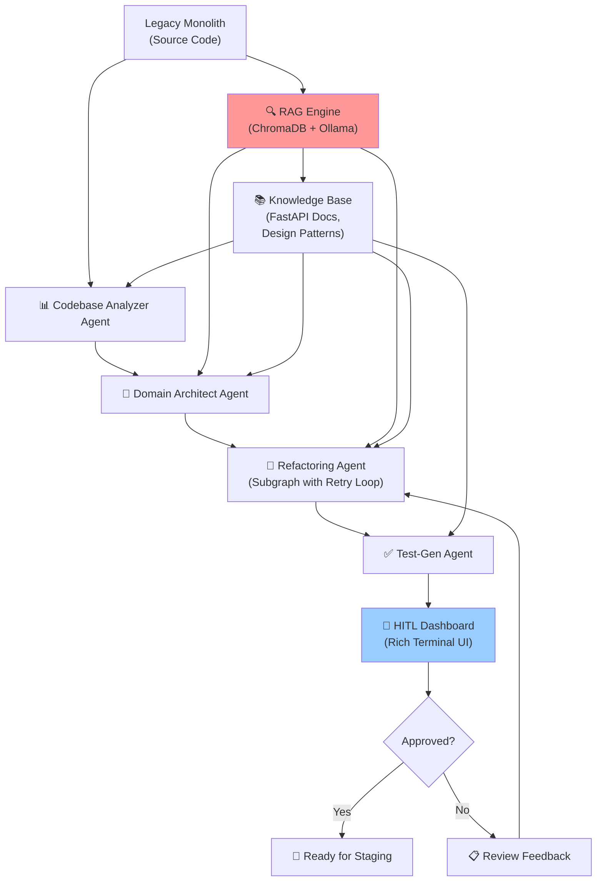

# Agentic Software Architecture Migration Assistant — Implementation Plan

## Executive Summary

Build an **autonomous, AI-powered system** that migrates legacy monolithic codebases to modern microservices architectures (FastAPI) using a multi-agent orchestration framework with Retrieval-Augmented Generation (RAG), automated testing, and human-in-the-loop governance. This plan reduces architecture migration timelines from **months to weeks** while maintaining 100% functional parity.

---

## Architecture Overview



---

## Project Structure

```text
ArchitectureMigrationAssistant/
│
├── 📁 core/
│   ├── __init__.py
│   ├── orchestrator.py              # Main LangGraph StateGraph & workflow
│   ├── config.py                    # Configuration, models, retries
│   ├── constants.py                 # Pydantic schemas, TypedDicts, Enums
│   └── routing.py                   # Edge routing & retry loop logic
│
├── 📁 agents/
│   ├── __init__.py
│   ├── analyzer_agent.py            # Codebase parsing & AST analysis
│   ├── architect_agent.py           # Domain-Driven Design & microservice boundaries
│   ├── refactoring_agent.py         # FastAPI code generation & transformation
│   └── test_gen_agent.py            # Unit & integration test generation
│
├── 📁 rag/
│   ├── __init__.py
│   ├── vector_store.py              # ChromaDB integration
│   └── retriever.py                 # Context-aware retrieval for agents
│
├── 📁 tools/
│   ├── __init__.py
│   └── ...                          # Code analysis and interaction tools
│
├── 📁 ui/
│   ├── __init__.py
│   └── dashboard.py                 # Rich terminal UI for monitoring & HITL
│
├── 📁 storage/
│   ├── __init__.py
│   ├── cache.py                     # DiskCache for agent context and LLM outputs
│   └── audit_logger.py              # File-based structured logging & audit trail
│
├── 📁 tests/
│   └── core/
│       └── test_orchestrator_fanout.py # E2E tests for LangGraph fan-out/retries
│
├── main.py                          # CLI entry point
└── README.md                        # Quick start guide
```

---

## Core Components

### 1. **Orchestrator & LangGraph Workflow** (`core/orchestrator.py`)

The multi-agent workflow engine coordinating all phases of migration using LangGraph's Send API for fan-out and Subgraphs for retry loops:

```python
# Pseudo-code: LangGraph state machine
class PipelineState(TypedDict):
    project_id: str
    source_path: str
    source_code: Dict[str, str]
    current_phase: AgentPhase
    analyzer_output: Optional[AnalyzerOutput]
    dependency_review_approved: bool
    architect_output: Optional[ArchitectOutput]
    service_units: Annotated[List[ServiceUnit], operator.add]
    human_approvals: Annotated[List[Dict], operator.add]
    iteration_count: int
    errors: Annotated[List[str], operator.add]

Graph = {
    "analyze_codebase": analyzer_agent,
    "hitl_analyze": human_approval_gate,
    "design_architecture": architect_agent,
    "hitl_architect": human_approval_gate,
    
    # Fan-out to Subgraph per service using Send()
    "process_service": service_subgraph (Refactoring + Validation + TestGen),
    
    "join": merge_service_outputs,
    "hitl_final": final_human_approval_gate
}
```

**Key Features:**
- Stateful workflow with persistent graph storage (SQLite checkpoints)
- Fan-out to per-service parallel processing (`Send` API)
- Subgraph isolated retry loops for `py_compile` syntax validation
- Three targeted HITL (Human-in-the-Loop) gates
- Streaming logs to UI dashboard in real-time

### 2. **Analyzer Agent** (`agents/analyzer_agent.py`)

Autonomous parsing of legacy monolithic code:

**Responsibilities:**
- Parse Python AST to extract function calls, class hierarchies
- Generate dependency graph (nodes = functions/classes, edges = calls)
- Identify circular dependencies and coupling hotspots
- Calculate complexity metrics (cyclomatic complexity, lines of code)

**Output Format:** `AnalyzerOutput` (Pydantic schema with codebase stats and graphs)

### 3. **Domain Architect Agent** (`agents/architect_agent.py`)

Proposes logical microservice boundaries using Domain-Driven Design:

**Responsibilities:**
- Cluster tightly-coupled modules into bounded contexts
- Define service APIs (input/output contracts)
- Propose `ServiceBoundary` schemas with confidence scores

### 4. **Refactoring Agent** (`agents/refactoring_agent.py`)

Autonomous FastAPI microservice generation inside a Retry Loop:

**Responsibilities:**
- Transform legacy function signatures → FastAPI route definitions
- Auto-generate Pydantic validation schemas
- Emit syntax-validated Python code. If `py_compile` fails, the Orchestrator retries this agent.

### 5. **Test-Gen Agent** (`agents/test_gen_agent.py`)

Automated test suite generation:

**Responsibilities:**
- Generate unit tests for each microservice using pytest
- Output test cases and expected coverage targets

### 6. **Human-in-the-Loop (HITL) Dashboard** (`ui/dashboard.py`)

Rich terminal interface for governance:

**Checkpoints:**
1. **After Analyzer**: Review complexity and coupling metrics.
2. **After Architect**: Review proposed microservice boundaries.
3. **After Pipeline**: Final review of all generated services and tests.

---

## Technology Stack

### Core Orchestration
- **LangGraph** — Stateful multi-agent workflow orchestration
- **LangChain** — LLM abstraction layer & tool integration

### LLM Models
- **Primary**: Local generation using **Ollama** (e.g. `llama3`, `codellama`, `mistral`)
- **Alternative**: Gemini / Claude via API if configured

### Code Analysis & Generation
- **AST Parsing**: `ast` (Python)
- **Code Generation**: LLM-driven raw code generation validated by `py_compile`

### RAG Engine
- **Vector DB**: **ChromaDB** (Local SQLite-based vector store)
- **Embeddings**: Local Ollama embeddings

### Testing & Quality
- **Testing Framework**: `pytest`

### Backend & Deployment
- **Web Framework**: FastAPI (for the generated services)
- **Container**: Docker (for final deployment, not required during generation)

### Storage & Monitoring
- **Checkpoints**: SQLite (`langgraph.checkpoint.sqlite`)
- **Cache**: `diskcache` (DiskCache for LLM response caching)
- **Audit Logging**: Structured logging to local files (`audit.log`)

### UI / Dashboarding
- **Terminal UI**: `rich` and `prompt_toolkit` for interactive CLI and tables.

---

## Evaluation & Success Metrics

### Technical Metrics
| Metric | Target | Measurement |
|--------|--------|-------------|
| **Syntax Validity** | 100% | `py_compile` passes for all generated services |
| **Pipeline Success** | 100% | LangGraph runs to `END` node without crashing |
| **Agent Autonomy** | High | Fan-out and retry logic handles errors without human intervention |

### Capstone Presentation Metrics
- **Live Demo**: End-to-end migration of sample monolithic app via local LLM.
- **Resilience Demo**: Show the retry loop automatically fixing a syntax error generated by the refactoring agent.
- **LangGraph Fan-out**: Show multiple microservices being generated in parallel subgraphs.

---

**Last Updated**: 2026-07-30  
**Status**: Implementation Ready  
