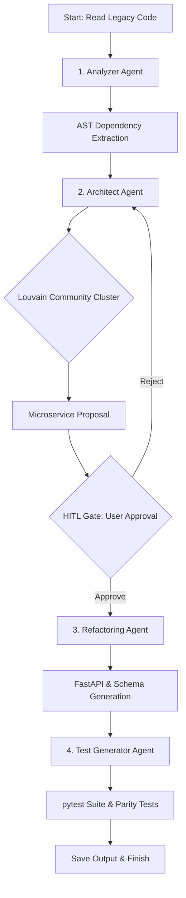

# Agentic Legacy Modernization System (ALMS)

> An agentic AI workflow framework powered by **LangGraph** to autonomously analyze legacy monolithic applications and migrate them into clean, containerized, test-validated **FastAPI microservices** using local **Ollama** LLMs and **ChromaDB** RAG.

---

## Key Features

- **AST Dependency Analysis**: Deterministically parses legacy python code into Abstract Syntax Trees (AST) using `ast` and `networkx` to build module call-graphs and detect coupling hotspots.
- **Louvain Clustering**: Groups related modules into domains/microservice candidates using the Louvain community detection algorithm.
- **Multi-Agent LangGraph Orchestration**: Runs a structured agent pipeline (`Analyzer` ➔ `Architect` ➔ `Refactoring` ➔ `TestGen`) with custom Pydantic output schemas for strict structure validation.
- **Human-In-The-Loop (HITL)**: Offers interactive checkpoints where you can review, approve, or reject proposed architectures and prompt the agents to iterate.
- **Local RAG System**: Automatically embeds and queries local design pattern documentation (using `nomic-embed-text` in ChromaDB) to inject Domain-Driven Design (DDD) best practices.
- **Retro DOS Terminal UI**: Draws interactive dashboard interfaces using the `rich` library, complete with ascii art banners, execution progress tables, and custom status updates.
- **Security & Safety checks**: Integrates security check mechanisms (e.g., Bandit hook configuration) and isolates output generation.
- **Automated Test Generation & Shadow Testing**: Writes `pytest` test suites and executes shadow parity tests comparing the inputs/outputs of legacy code against generated FastAPI services.

---

## System Architecture & Workflow

The orchestrator builds and runs a directed graph (`StateGraph`) that flows as follows:



---

## Directory Layout

```
├── core/
│   ├── config.py           # Configuration reader & YAML parser
│   ├── constants.py        # Pydantic schemas (Agent contracts) and system prompts
│   └── orchestrator.py     # LangGraph pipeline builder and StateGraph engine
├── agents/
│   ├── analyzer_agent.py   # Code parser and hotspot detector
│   ├── architect_agent.py  # Clustering and microservices designer
│   ├── refactoring_agent.py# Code generator translating monolith functions to FastAPI
│   └── test_gen_agent.py   # Test suite writer (pytest, async tests, parity tests)
├── rag/
│   ├── knowledge_base.py   # Document loader & semantic chunker
│   ├── vector_store.py     # ChromaDB client & Ollama integration
│   └── retriever.py        # Custom filter that feeds context to specific agents
├── tools/
│   ├── code_analysis.py    # AST syntax extraction and call-graph generator
│   ├── code_generation.py  # Code formatting (black, isort) and compiler sanity checker
│   └── testing.py          # Shadow/parity testing engine
├── safety/
│   └── validator.py        # Code validation checks
├── storage/
│   ├── audit_logger.py     # SQLite db tracker logging step times, decisions, and prompts
│   └── cache.py            # Local disk cache for saving agent inference outputs
├── ui/
│   └── dashboard.py        # Terminal GUI & progress dashboard
├── main.py                 # Core CLI entry point
├── config.yaml             # Settings configuration file
└── requirements.txt        # Python dependency manifest
```

---

## Prerequisites & Setup

### 1. Ollama Installation & Setup
Download and install [Ollama](https://ollama.com). Pull the required models:
```bash
# Pull the LLM (e.g. qwen3-coder:30b as configured in config.yaml)
ollama pull qwen3-coder:30b

# Pull the embedding model used for the RAG database
ollama pull nomic-embed-text
```

### 2. Python Environment Setup
Clone the repository and set up a virtual environment:
```powershell
# Create virtual environment
python -m venv venv
venv\Scripts\activate

# Install requirements
pip install -r requirements.txt
```

---

## How to Run

### Initialize the Knowledge Base (RAG)
Load the local architectural guidelines into ChromaDB:
```bash
python main.py --init-kb
```

### Run the Demo (Sample Monolith Migration)
To see the system in action, run the assistant on the built-in messy monolith:
```bash
python main.py --demo
```

### Run on a Custom Project
Run the pipeline against any python codebase directory:
```bash
python main.py <path_to_python_project>
```

### Skip Human-in-the-Loop Gate (for automated pipelines/scripts)
```bash
python main.py --skip-hitl <path_to_python_project>
```

---

## Customization

Customize agent temperatures, model choices, RAG thresholds, or context windows in [config.yaml](./config.yaml):
```yaml
ollama:
  host: "http://localhost:11434"
  model: "qwen3-coder:30b"
  embedding_model: "nomic-embed-text"
```
