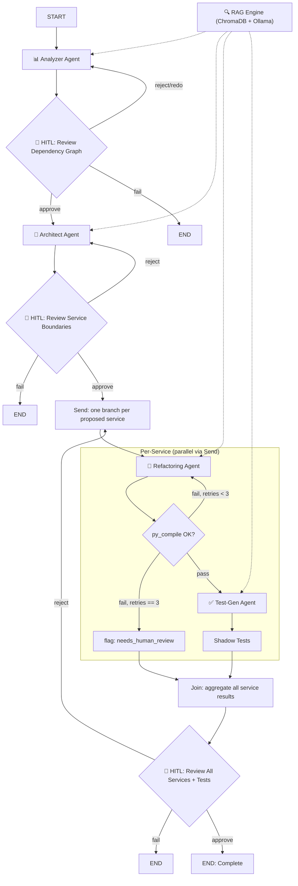

# LangGraph Redesign Implementation Plan

> **For agentic workers:** REQUIRED SUB-SKILL: Use superpowers:subagent-driven-development (recommended) or superpowers:executing-plans to implement this plan task-by-task. Steps use checkbox (`- [ ]`) syntax for tracking.

**Goal:** Replace the sequential, single-pass LangGraph orchestrator in `core/orchestrator.py` with a self-correcting, parallel-fan-out design: a 3rd HITL gate after Analyze, per-service `refactor → validate(py_compile) → retry(max 3)` loops running concurrently via LangGraph's `Send` map-reduce API, and a bundled final review gate — fixing the existing bug where Test-Gen only processes the first proposed service.

**Architecture:** `core/constants.py` gains a `ServiceUnit` model tracking one proposed microservice through refactor/validate/test. `core/orchestrator.py`'s `StateGraph` grows from 6 to 10 nodes: `analyze → hitl_analyze → architect → hitl_architect → [Send fan-out] → refactor_service ⇄ validate_service → (mark_needs_review | test_gen_service) → join → hitl_final`. A custom reducer (`_replace_by_service_name`, not `operator.add`) merges parallel branch results by service name so retries and rejection-driven re-runs don't duplicate entries.

**Tech Stack:** LangGraph `StateGraph`/`Send` (map-reduce), Pydantic v2, `py_compile` (existing `tools/code_generation.py`), SQLite (`storage/audit_logger.py`), pytest for all new tests (routing logic and orchestrator flow are tested with fakes — no live Ollama/LLM calls required).

**Spec:** `docs/superpowers/specs/2026-07-30-langgraph-redesign-design.md` — read it before starting; this plan implements it exactly, task by task.

---

## Task 1: Verify environment and the LangGraph `Send` import path

Nothing is coded yet — this just confirms the toolchain actually has what later tasks depend on, since `langgraph` isn't currently installed in this environment (`requirements.txt` only pins `langgraph>=0.1.0`, loosely).

**Files:** none.

- [ ] **Step 1: Install dependencies**

Run: `pip install -r requirements.txt`
Expected: completes without error; `langgraph`, `ollama`, `chromadb`, `pytest` all installed.

- [ ] **Step 2: Confirm the `Send` import path for the installed version**

Run: `python -c "from langgraph.types import Send; from langgraph.graph import StateGraph, START, END; print('Send OK:', Send)"`

Expected: prints `Send OK: <class 'langgraph.types.Send'>` (or similar). If this raises `ImportError`, run instead: `python -c "from langgraph.graph import Send; print('Send OK:', Send)"`. Whichever import succeeds is the one used in Task 6 — note it down now.

---

## Task 2: `ServiceUnit` model and `PipelineState` schema update

**Files:**
- Modify: `core/constants.py:199-215` (the `PipelineState` class)
- Test: `tests/core/test_constants.py`

- [ ] **Step 1: Write the failing test**

```python
# tests/core/test_constants.py
import sys
sys.path.insert(0, ".")

from core.constants import ServiceUnit, PipelineState, ServiceBoundary


def test_service_unit_defaults():
    unit = ServiceUnit(service=ServiceBoundary(name="user-service", bounded_context="Users"))
    assert unit.compile_attempts == 0
    assert unit.needs_human_review is False
    assert unit.status == "pending"
    assert unit.refactoring_output is None
    assert unit.test_gen_output is None


def test_pipeline_state_service_units_default_empty():
    state = PipelineState(project_id="p1", source_path="/tmp/x")
    assert state.service_units == []
    assert state.dependency_review_approved is False
```

- [ ] **Step 2: Run test to verify it fails**

Run: `pytest tests/core/test_constants.py -v`
Expected: FAIL — `ImportError: cannot import name 'ServiceUnit'`.

- [ ] **Step 3: Add `ServiceUnit` and update `PipelineState`**

In `core/constants.py`, replace the existing `PipelineState` class (currently at lines 199-215) with:

```python
class ServiceUnit(BaseModel):
    """Tracks one proposed microservice through refactor -> validate -> test.

    Replaces the old flat `refactoring_outputs` list / single `test_gen_output`
    field so every proposed service (not just the first) carries its own
    refactor output, test output, and retry state through the graph.
    """
    service: ServiceBoundary
    refactoring_output: Optional[RefactoringOutput] = None
    test_gen_output: Optional[TestGenOutput] = None
    compile_attempts: int = 0
    needs_human_review: bool = False
    status: str = "pending"  # pending | refactoring | validating | testing | done | failed


class PipelineState(BaseModel):
    """The stateful workflow state passed between agents.

    Matches the State dict from ARCHITECTURE_MIGRATION_IMPLEMENTATION_PLAN.md.
    """
    project_id: str = ""
    source_path: str = ""
    source_code: Dict[str, str] = Field(default_factory=dict, description="filename -> content")
    current_phase: AgentPhase = AgentPhase.INIT
    analyzer_output: Optional[AnalyzerOutput] = None
    dependency_review_approved: bool = False
    architect_output: Optional[ArchitectOutput] = None
    service_units: List[ServiceUnit] = Field(default_factory=list)
    human_approvals: List[Dict[str, Any]] = Field(default_factory=list)
    iteration_count: int = 0
    errors: List[str] = Field(default_factory=list)
```

`ServiceUnit` must be defined after `ServiceBoundary`, `RefactoringOutput`, and `TestGenOutput` (already true, since `PipelineState` was already last in the file) and before `PipelineState`.

- [ ] **Step 4: Run test to verify it passes**

Run: `pytest tests/core/test_constants.py -v`
Expected: PASS (2 tests).

- [ ] **Step 5: Commit**

```bash
git add core/constants.py tests/core/test_constants.py
git commit -m "feat: add ServiceUnit model, replace flat refactoring/test fields on PipelineState"
```

---

## Task 3: Thread-safe `AuditLogger`

Multiple parallel `Send` branches (Task 6) will call `AuditLogger.log_agent_action` concurrently from different threads. `sqlite3` connections opened with `check_same_thread=False` are usable across threads but not safe for concurrent *writes* without external serialization — add a lock.

**Files:**
- Modify: `storage/audit_logger.py`
- Test: `tests/storage/test_audit_logger_concurrency.py`

- [ ] **Step 1: Write the test**

```python
# tests/storage/test_audit_logger_concurrency.py
import sys
import threading
sys.path.insert(0, ".")

from storage.audit_logger import AuditLogger


class FakeConfig:
    def __init__(self, db_path):
        self.audit_db_path = db_path


def test_concurrent_log_agent_action_no_errors(tmp_path):
    db_path = str(tmp_path / "audit_test.db")
    logger = AuditLogger(config=FakeConfig(db_path))
    errors = []

    def worker(i):
        try:
            logger.log_agent_action("refactoring", f"service-{i}", phase="refactoring")
        except Exception as e:
            errors.append(e)

    threads = [threading.Thread(target=worker, args=(i,)) for i in range(20)]
    for t in threads:
        t.start()
    for t in threads:
        t.join()

    assert errors == []
    logs = logger.get_recent_logs(limit=50)
    assert len(logs) == 20
    logger.close()
```

Note: this test may pass even before the fix — SQLite's own file locking makes `database is locked` errors timing-dependent, not guaranteed on every run. Implement the lock regardless; it removes any chance of that error once real parallel branches (Task 6) start logging concurrently.

- [ ] **Step 2: Run test**

Run: `pytest tests/storage/test_audit_logger_concurrency.py -v`
Expected: PASS (this is a regression guard, not a strict red/green gate — see note above).

- [ ] **Step 3: Add the lock**

In `storage/audit_logger.py`, add `import threading` to the imports at the top. In `AuditLogger.__init__` (currently lines 26-30), add the lock:

```python
    def __init__(self, config: Optional[Config] = None):
        self.config = config or Config()
        self.db_path = self.config.audit_db_path
        self._conn = None
        self._lock = threading.Lock()
        self._init_db()
```

Wrap the body of `log_agent_action` (lines 82-123), `log_hitl_decision` (125-149), `start_pipeline_run` (151-160), and `complete_pipeline_run` (162-175) each in `with self._lock:`. For example, `log_agent_action` becomes:

```python
    def log_agent_action(
        self,
        agent: str,
        action: str,
        phase: str = "",
        details: Optional[Dict] = None,
        duration_ms: int = 0,
        success: bool = True,
        error_message: str = "",
    ):
        with self._lock:
            conn = self._get_conn()
            conn.execute(
                """INSERT INTO audit_log
                (timestamp, agent, action, phase, details, duration_ms, success, error_message)
                VALUES (?, ?, ?, ?, ?, ?, ?, ?)""",
                (
                    datetime.now().isoformat(),
                    agent,
                    action,
                    phase,
                    json.dumps(details) if details else None,
                    duration_ms,
                    1 if success else 0,
                    error_message,
                )
            )
            conn.commit()

        level = logging.INFO if success else logging.ERROR
        logger.log(level, f"[{agent}] {action} ({duration_ms}ms) {'✓' if success else '✗ ' + error_message}")
```

Apply the same lock to the other three methods:

```python
    def log_hitl_decision(
        self,
        checkpoint: str,
        approved: bool,
        approver: str = "user",
        feedback: str = "",
        iteration: int = 1,
    ):
        """Log a Human-in-the-Loop decision."""
        with self._lock:
            conn = self._get_conn()
            conn.execute(
                """INSERT INTO hitl_decisions
                (timestamp, checkpoint, approved, approver, feedback, iteration)
                VALUES (?, ?, ?, ?, ?, ?)""",
                (
                    datetime.now().isoformat(),
                    checkpoint,
                    1 if approved else 0,
                    approver,
                    feedback,
                    iteration,
                )
            )
            conn.commit()
        logger.info(f"[HITL] {checkpoint}: {'APPROVED' if approved else 'REJECTED'} by {approver}")

    def start_pipeline_run(self, project_id: str, source_path: str) -> int:
        """Record the start of a pipeline run. Returns run ID."""
        with self._lock:
            conn = self._get_conn()
            cursor = conn.execute(
                """INSERT INTO pipeline_runs (project_id, source_path, started_at)
                VALUES (?, ?, ?)""",
                (project_id, source_path, datetime.now().isoformat())
            )
            conn.commit()
            return cursor.lastrowid

    def complete_pipeline_run(
        self, run_id: int, status: str = "completed",
        services: int = 0, tests: int = 0, summary: str = ""
    ):
        """Record pipeline completion."""
        with self._lock:
            conn = self._get_conn()
            conn.execute(
                """UPDATE pipeline_runs
                SET completed_at = ?, status = ?, services_generated = ?,
                    tests_generated = ?, summary = ?
                WHERE id = ?""",
                (datetime.now().isoformat(), status, services, tests, summary, run_id)
            )
            conn.commit()
```

- [ ] **Step 4: Run test to verify it still passes**

Run: `pytest tests/storage/test_audit_logger_concurrency.py -v`
Expected: PASS.

- [ ] **Step 5: Commit**

```bash
git add storage/audit_logger.py tests/storage/test_audit_logger_concurrency.py
git commit -m "fix: serialize AuditLogger SQLite writes with a lock for concurrent graph branches"
```

---

## Task 4: Pure routing helpers

Today, the fail-keyword check (`quit`/`exit`/`stop`/`fail`) is duplicated inline in `_route_hitl_architect` and `_route_hitl_tests`. Extract it, and the new py_compile retry decision, into pure module-level functions — testable without constructing agents, Ollama, or ChromaDB.

**Files:**
- Modify: `core/orchestrator.py` (add functions near the top, after imports; refactor two existing methods)
- Test: `tests/core/test_routing.py`

- [ ] **Step 1: Write the failing test**

```python
# tests/core/test_routing.py
import sys
sys.path.insert(0, ".")

from core.orchestrator import route_after_hitl, next_compile_action


def test_route_after_hitl_approved():
    assert route_after_hitl(True, "") == "approve"


def test_route_after_hitl_rejected_with_normal_feedback():
    assert route_after_hitl(False, "please add pagination") == "reject"


def test_route_after_hitl_rejected_with_stop_keyword():
    for word in ("quit", "exit", "stop", "fail", "QUIT", " Stop "):
        assert route_after_hitl(False, word) == "fail"


def test_next_compile_action_pass():
    assert next_compile_action(compile_attempts=1, passed=True) == "pass"


def test_next_compile_action_retry_below_max():
    assert next_compile_action(compile_attempts=1, passed=False, max_attempts=3) == "retry"
    assert next_compile_action(compile_attempts=2, passed=False, max_attempts=3) == "retry"


def test_next_compile_action_needs_review_at_max():
    assert next_compile_action(compile_attempts=3, passed=False, max_attempts=3) == "needs_review"
```

- [ ] **Step 2: Run test to verify it fails**

Run: `pytest tests/core/test_routing.py -v`
Expected: FAIL — `ImportError: cannot import name 'route_after_hitl'`.

- [ ] **Step 3: Add the functions to `core/orchestrator.py`**

Add this after the module-level `logger = logging.getLogger(...)` line (currently line 31), before `class GraphState`:

```python
def route_after_hitl(approved: bool, feedback: str) -> str:
    """Decide graph routing from a HITL decision.

    Returns 'approve', 'fail' (feedback is a stop keyword), or 'reject'.
    """
    if approved:
        return "approve"
    if feedback.strip().lower() in ("quit", "exit", "stop", "fail"):
        return "fail"
    return "reject"


def next_compile_action(compile_attempts: int, passed: bool, max_attempts: int = 3) -> str:
    """Decide what to do after a py_compile validation attempt.

    Returns 'pass' (move to test-gen), 'retry' (loop back to refactor),
    or 'needs_review' (exhausted retries, flag for a human).
    """
    if passed:
        return "pass"
    if compile_attempts < max_attempts:
        return "retry"
    return "needs_review"


def _replace_by_service_name(existing: list, updates: list) -> list:
    """Reducer for the `service_units` graph channel.

    Merges by `service.name` instead of concatenating (unlike `operator.add`):
    each parallel Send branch contributes exactly one entry per service, and
    if the human rejects the final gate and the fan-out re-runs, the new
    result replaces the old one for that service instead of duplicating it.
    """
    merged = {u.service.name: u for u in existing}
    for u in updates:
        merged[u.service.name] = u
    return list(merged.values())
```

- [ ] **Step 4: Refactor the two existing routing methods to use `route_after_hitl`**

Replace `_route_hitl_architect` (currently lines 235-245):

```python
    def _route_hitl_architect(self, gstate: GraphState) -> str:
        state = gstate["state"]
        approved = getattr(state, "_last_hitl_approved", True)
        feedback = state.human_approvals[-1].get("feedback", "") if state.human_approvals else ""
        route = route_after_hitl(approved, feedback)
        if route == "fail":
            state.current_phase = AgentPhase.FAILED
            self._emit("pipeline_rejected", {"checkpoint": "after_architect"})
        return route
```

Replace `_route_hitl_tests` (currently lines 309-318) the same way:

```python
    def _route_hitl_tests(self, gstate: GraphState) -> str:
        state = gstate["state"]
        approved = getattr(state, "_last_hitl_approved", True)
        feedback = state.human_approvals[-1].get("feedback", "") if state.human_approvals else ""
        route = route_after_hitl(approved, feedback)
        if route == "fail":
            state.current_phase = AgentPhase.FAILED
            self._emit("pipeline_rejected", {"checkpoint": "after_test_gen"})
        return route
```

(`_route_hitl_tests` and its call site get renamed/replaced entirely in Task 7 — this step just DRYs up the duplicated keyword check without changing behavior yet.)

- [ ] **Step 5: Run test to verify it passes**

Run: `pytest tests/core/test_routing.py -v`
Expected: PASS (6 tests).

- [ ] **Step 6: Run the full existing test suite to check nothing broke**

Run: `pytest tests/ -v`
Expected: all tests PASS (only the ones added so far).

- [ ] **Step 7: Commit**

```bash
git add core/orchestrator.py tests/core/test_routing.py
git commit -m "refactor: extract pure route_after_hitl/next_compile_action/_replace_by_service_name helpers"
```

---

## Task 5: Analyze-review HITL gate (3rd gate)

**Files:**
- Modify: `core/orchestrator.py` (`_build_graph`, add two new methods)
- Modify: `config.yaml` (`hitl.checkpoints` list)

- [ ] **Step 1: Add the new node and routing method**

Add these two methods to `PipelineOrchestrator`, near `_node_hitl_architect`/`_route_hitl_architect` (after line 245 in the current file):

```python
    def _node_hitl_analyze(self, gstate: GraphState) -> GraphState:
        state = gstate["state"]
        if getattr(state, "_skip_hitl", False):
            state._last_hitl_approved = True
            state.dependency_review_approved = True
            return {"state": state}

        approved = self._hitl_checkpoint("after_analyze", state.analyzer_output, state)
        state._last_hitl_approved = approved
        state.dependency_review_approved = approved
        return {"state": state}

    def _route_hitl_analyze(self, gstate: GraphState) -> str:
        state = gstate["state"]
        approved = getattr(state, "_last_hitl_approved", True)
        feedback = state.human_approvals[-1].get("feedback", "") if state.human_approvals else ""
        route = route_after_hitl(approved, feedback)
        if route == "fail":
            state.current_phase = AgentPhase.FAILED
            self._emit("pipeline_rejected", {"checkpoint": "after_analyze"})
        return route
```

- [ ] **Step 2: Rewire `_build_graph`**

In `_build_graph` (currently lines 78-107), change:

```python
        builder.add_node("analyze", self._node_analyze)
        builder.add_node("architect", self._node_architect)
        builder.add_node("hitl_architect", self._node_hitl_architect)
```

to:

```python
        builder.add_node("analyze", self._node_analyze)
        builder.add_node("hitl_analyze", self._node_hitl_analyze)
        builder.add_node("architect", self._node_architect)
        builder.add_node("hitl_architect", self._node_hitl_architect)
```

and change:

```python
        builder.add_edge(START, "analyze")
        builder.add_edge("analyze", "architect")
        builder.add_edge("architect", "hitl_architect")
```

to:

```python
        builder.add_edge(START, "analyze")
        builder.add_edge("analyze", "hitl_analyze")

        builder.add_conditional_edges(
            "hitl_analyze",
            self._route_hitl_analyze,
            {"approve": "architect", "reject": "analyze", "fail": END},
        )

        builder.add_edge("architect", "hitl_architect")
```

(The rest of `_build_graph` — the refactor/test_gen portion — is rewritten in Task 6, so leave it as-is for now; this task only touches the analyze→architect transition.)

- [ ] **Step 3: Add the checkpoint name to `config.yaml`**

In `config.yaml`, under the `hitl:` section (currently lines 71-76), update:

```yaml
hitl:
  approval_mode: "cli"  # "cli" or "streamlit"
  checkpoints:
    - "after_analyze"
    - "after_architect"
    - "after_test_gen"
```

- [ ] **Step 4: Smoke-test the graph builds**

Run: `python -c "from core.orchestrator import PipelineOrchestrator; PipelineOrchestrator()"`
Expected: no exception (this constructs the real orchestrator including the real `VectorStore`/`AuditLogger`/agents — it's fine as a quick compile-and-wire check since none of those do network I/O at construction time; it will write to the real `./audit.db`/`./cache_db`/`./chroma_db` in the project root, which is expected here — those are already gitignored/existing artifacts, not test fixtures).

- [ ] **Step 5: Run the full test suite**

Run: `pytest tests/ -v`
Expected: all PASS (no test yet exercises the new gate directly — Task 9's end-to-end test covers it).

- [ ] **Step 6: Commit**

```bash
git add core/orchestrator.py config.yaml
git commit -m "feat: add analyze-review HITL gate before the Architect stage"
```

---

## Task 6: Per-service fan-out (`Send`) with retry loop

This is the core of the redesign: replace the sequential `for` loop in the current `_node_refactor`/`_node_test_gen` with parallel per-service branches.

**Files:**
- Modify: `core/orchestrator.py` (imports, `GraphState`, `_build_graph`, new node methods, delete old `_node_refactor`/`_node_test_gen`)

- [ ] **Step 1: Update imports and `GraphState`**

At the top of `core/orchestrator.py`, add to the existing imports:

```python
import operator
from typing import Annotated
```

(keep the existing `from typing import Dict, Any, Optional, Callable, TypedDict` line, just add the `Annotated` import alongside it, e.g. `from typing import Dict, Any, Optional, Callable, TypedDict, List, Annotated`)

Change the LangGraph import line (currently `from langgraph.graph import StateGraph, START, END`) to also import `Send`, using whichever path Task 1 confirmed works, e.g.:

```python
from langgraph.graph import StateGraph, START, END
from langgraph.types import Send
```

Add `ServiceUnit` to the `core.constants` import line (currently `from core.constants import PipelineState, AgentPhase, AnalyzerOutput, ArchitectOutput`):

```python
from core.constants import (
    PipelineState, AgentPhase, AnalyzerOutput, ArchitectOutput,
    ServiceUnit, ServiceBoundary, RefactoringOutput,
)
```

Replace the `GraphState` class (currently lines 34-36):

```python
class GraphState(TypedDict):
    """The state channels for LangGraph.

    `state` uses default (replace) semantics — only nodes outside the
    per-service fan-out write to it, to avoid two parallel branches racing
    to overwrite each other's PipelineState. `service_units` uses the
    `_replace_by_service_name` reducer so every parallel branch (and every
    rejection-driven re-run) merges its result in by service name instead of
    duplicating. The remaining keys are branch-local working fields for the
    per-service refactor -> validate -> test_gen sequence dispatched via `Send`.
    """
    state: PipelineState
    service_units: Annotated[List[ServiceUnit], _replace_by_service_name]
    branch_service: Optional[ServiceBoundary]
    branch_compile_attempts: int
    branch_refactoring_output: Optional[RefactoringOutput]
    branch_last_error: Optional[str]
```

- [ ] **Step 2: Add a shared Send-dispatch helper**

Add this method to `PipelineOrchestrator` (anywhere among the other private methods, e.g. right before `_node_refactor`):

```python
    def _dispatch_refactor_sends(self, state: PipelineState) -> list:
        """One Send per proposed service, each starting a fresh retry counter."""
        return [
            Send("refactor_service", {
                "state": state,
                "branch_service": svc,
                "branch_compile_attempts": 0,
                "branch_refactoring_output": None,
                "branch_last_error": None,
            })
            for svc in state.architect_output.proposed_services
        ]
```

- [ ] **Step 3: Delete the old `_node_refactor` and `_node_test_gen`, add the new per-service nodes**

Delete `_node_refactor` (currently lines 247-274) and `_node_test_gen` (currently lines 276-297) entirely. Replace them with:

```python
    def _node_refactor_service(self, gstate: GraphState) -> Dict[str, Any]:
        state = gstate["state"]
        service = gstate["branch_service"]
        attempts = gstate["branch_compile_attempts"] + 1

        self._emit("refactoring_service", {"service": service.name, "attempt": attempts})
        start = time.time()
        try:
            output = self.refactoring.refactor_service(service, state.source_code)
        except Exception as e:
            logger.error(f"Refactoring failed for {service.name}: {e}")
            self.audit.log_agent_action(
                "refactoring", f"{service.name} raised an exception",
                phase="refactoring", success=False, error_message=str(e),
            )
            return {
                "branch_service": service,
                "branch_compile_attempts": attempts,
                "branch_refactoring_output": None,
                "branch_last_error": str(e),
            }

        duration = int((time.time() - start) * 1000)
        self.audit.log_agent_action(
            "refactoring", f"Generated {service.name} (attempt {attempts})",
            phase="refactoring", duration_ms=duration,
            details={"py_compile_passed": output.py_compile_passed},
        )
        return {
            "branch_service": service,
            "branch_compile_attempts": attempts,
            "branch_refactoring_output": output,
            "branch_last_error": None,
        }

    def _node_validate_service(self, gstate: GraphState) -> Dict[str, Any]:
        # No-op node: the routing decision happens in _route_validate_service.
        # Present as its own node (rather than folded into refactor_service)
        # so the retry loop is visible as a distinct graph edge.
        return {}

    def _route_validate_service(self, gstate: GraphState) -> str:
        output = gstate["branch_refactoring_output"]
        passed = bool(output) and output.py_compile_passed
        action = next_compile_action(
            compile_attempts=gstate["branch_compile_attempts"],
            passed=passed,
            max_attempts=self.config.max_retries,
        )
        return {
            "retry": "refactor_service",
            "needs_review": "mark_needs_review",
            "pass": "test_gen_service",
        }[action]

    def _node_mark_needs_review(self, gstate: GraphState) -> Dict[str, Any]:
        service = gstate["branch_service"]
        unit = ServiceUnit(
            service=service,
            refactoring_output=gstate["branch_refactoring_output"],
            compile_attempts=gstate["branch_compile_attempts"],
            needs_human_review=True,
            status="failed",
        )
        self.audit.log_agent_action(
            "refactoring", f"{service.name} exceeded retry limit ({gstate['branch_compile_attempts']} attempts)",
            phase="refactoring", success=False,
            error_message=gstate.get("branch_last_error") or "py_compile failed repeatedly",
        )
        return {"service_units": [unit]}

    def _node_test_gen_service(self, gstate: GraphState) -> Dict[str, Any]:
        state = gstate["state"]
        service = gstate["branch_service"]
        refactoring_output = gstate["branch_refactoring_output"]

        start = time.time()
        try:
            test_output = self.test_gen.generate_tests(refactoring_output, state.source_code)
        except Exception as e:
            logger.error(f"Test generation failed for {service.name}: {e}")
            self.audit.log_agent_action(
                "test_gen", f"{service.name} test generation raised an exception",
                phase="testing", success=False, error_message=str(e),
            )
            unit = ServiceUnit(
                service=service,
                refactoring_output=refactoring_output,
                compile_attempts=gstate["branch_compile_attempts"],
                needs_human_review=True,
                status="failed",
            )
            return {"service_units": [unit]}

        duration = int((time.time() - start) * 1000)
        self.audit.log_agent_action(
            "test_gen", f"Generated tests for {service.name}",
            phase="testing", duration_ms=duration,
            details={"tests": test_output.total_tests},
        )
        unit = ServiceUnit(
            service=service,
            refactoring_output=refactoring_output,
            test_gen_output=test_output,
            compile_attempts=gstate["branch_compile_attempts"],
            needs_human_review=False,
            status="done",
        )
        return {"service_units": [unit]}

    def _node_join(self, gstate: GraphState) -> GraphState:
        state = gstate["state"]
        state.service_units = gstate["service_units"]
        state.current_phase = AgentPhase.TESTING
        total_tests = sum(
            u.test_gen_output.total_tests for u in state.service_units if u.test_gen_output
        )
        self._emit("phase_complete", {
            "phase": "testing",
            "services_processed": len(state.service_units),
            "tests_generated": total_tests,
        })
        return {"state": state}
```

- [ ] **Step 4: Rewire `_build_graph`'s refactor/test_gen portion**

Replace (currently lines 82-107 in the pre-Task-5 file — after Task 5 these line numbers shifted by the added `hitl_analyze` node/edges, so match by content instead):

```python
        builder.add_node("refactor", self._node_refactor)
        builder.add_node("test_gen", self._node_test_gen)
        builder.add_node("hitl_tests", self._node_hitl_tests)

        ...

        builder.add_conditional_edges(
            "hitl_architect",
            self._route_hitl_architect,
            {"approve": "refactor", "reject": "architect", "fail": END}
        )

        builder.add_edge("refactor", "test_gen")
        builder.add_edge("test_gen", "hitl_tests")

        builder.add_conditional_edges(
            "hitl_tests",
            self._route_hitl_tests,
            {"approve": END, "reject": "test_gen", "fail": END}
        )
```

with:

```python
        builder.add_node("refactor_service", self._node_refactor_service)
        builder.add_node("validate_service", self._node_validate_service)
        builder.add_node("mark_needs_review", self._node_mark_needs_review)
        builder.add_node("test_gen_service", self._node_test_gen_service)
        builder.add_node("join", self._node_join)

        def _route_after_architect_hitl(gstate: GraphState):
            state = gstate["state"]
            approved = getattr(state, "_last_hitl_approved", True)
            feedback = state.human_approvals[-1].get("feedback", "") if state.human_approvals else ""
            route = route_after_hitl(approved, feedback)
            if route == "fail":
                state.current_phase = AgentPhase.FAILED
                self._emit("pipeline_rejected", {"checkpoint": "after_architect"})
                return END
            if route == "reject":
                return "architect"
            return self._dispatch_refactor_sends(state)

        builder.add_conditional_edges(
            "hitl_architect",
            _route_after_architect_hitl,
            ["architect", "refactor_service", END],
        )

        builder.add_edge("refactor_service", "validate_service")
        builder.add_conditional_edges(
            "validate_service",
            self._route_validate_service,
            {
                "refactor_service": "refactor_service",
                "mark_needs_review": "mark_needs_review",
                "test_gen_service": "test_gen_service",
            },
        )
        builder.add_edge("mark_needs_review", "join")
        builder.add_edge("test_gen_service", "join")
```

(The `join → hitl_final` wiring is added in Task 7.) Note `_route_after_architect_hitl` is a closure (not a bound method) so it can call `self._dispatch_refactor_sends`/`self._emit` while still being a plain function LangGraph can call positionally — this matches how the other conditional-edge functions are already passed as `self._route_x` bound methods.

This closure supersedes the `_route_hitl_architect` method DRY'd up in Task 4, Step 4 — that method is no longer referenced by any edge. Delete it now:

```python
    def _route_hitl_architect(self, gstate: GraphState) -> str:
        state = gstate["state"]
        approved = getattr(state, "_last_hitl_approved", True)
        feedback = state.human_approvals[-1].get("feedback", "") if state.human_approvals else ""
        route = route_after_hitl(approved, feedback)
        if route == "fail":
            state.current_phase = AgentPhase.FAILED
            self._emit("pipeline_rejected", {"checkpoint": "after_architect"})
        return route
```

Delete this whole method from `PipelineOrchestrator` — its logic now lives inline in `_route_after_architect_hitl` above.

- [ ] **Step 5: Smoke-test the graph still builds**

Run: `python -c "from core.orchestrator import PipelineOrchestrator; PipelineOrchestrator()"`
Expected: no exception.

- [ ] **Step 6: Run the full test suite**

Run: `pytest tests/ -v`
Expected: all PASS (Task 9 adds the test that actually exercises this fan-out end-to-end; this task's job is just to get it wired without crashing).

- [ ] **Step 7: Commit**

```bash
git add core/orchestrator.py
git commit -m "feat: replace sequential refactor/test-gen loop with per-service Send fan-out and retry gate"
```

---

## Task 7: Final HITL gate on `service_units`, `run()` updates

**Files:**
- Modify: `core/orchestrator.py` (`_node_hitl_tests` → `_node_hitl_final`, `_route_hitl_tests` deleted, `run()`)

- [ ] **Step 1: Replace the old test-gen HITL node/routing with the final gate**

Delete `_node_hitl_tests` and `_route_hitl_tests` (the DRY'd-up version from Task 4, Step 4). Add:

```python
    def _node_hitl_final(self, gstate: GraphState) -> GraphState:
        state = gstate["state"]
        if getattr(state, "_skip_hitl", False):
            state._last_hitl_approved = True
            return {"state": state}

        approved = self._hitl_checkpoint("after_test_gen", state.service_units, state)
        state._last_hitl_approved = approved
        return {"state": state}

    def _route_hitl_final(self, gstate: GraphState):
        state = gstate["state"]
        approved = getattr(state, "_last_hitl_approved", True)
        feedback = state.human_approvals[-1].get("feedback", "") if state.human_approvals else ""
        route = route_after_hitl(approved, feedback)
        if route == "fail":
            state.current_phase = AgentPhase.FAILED
            self._emit("pipeline_rejected", {"checkpoint": "after_test_gen"})
            return END
        if route == "approve":
            return END
        return self._dispatch_refactor_sends(state)
```

- [ ] **Step 2: Wire it into `_build_graph`**

Add, right after the `join`/`mark_needs_review`/`test_gen_service` edges from Task 6:

```python
        builder.add_node("hitl_final", self._node_hitl_final)
        builder.add_edge("join", "hitl_final")
        builder.add_conditional_edges(
            "hitl_final",
            self._route_hitl_final,
            ["refactor_service", END],
        )
```

- [ ] **Step 3: Update `run()` to read `service_units` instead of the deleted fields**

In `run()` (currently lines 109-157), change the `graph.invoke` call:

```python
            final_state = self.graph.invoke({
                "state": self.state,
                "service_units": [],
                "branch_service": None,
                "branch_compile_attempts": 0,
                "branch_refactoring_output": None,
                "branch_last_error": None,
            })
            self.state = final_state["state"]

            if self.state.current_phase != AgentPhase.FAILED:
                self.state.current_phase = AgentPhase.COMPLETE
                total_tests = sum(
                    u.test_gen_output.total_tests for u in self.state.service_units if u.test_gen_output
                )
                self._emit("pipeline_complete", {
                    "services": len(self.state.service_units),
                    "tests": total_tests,
                })

                self.audit.complete_pipeline_run(
                    self.run_id, "completed",
                    services=len(self.state.service_units),
                    tests=total_tests,
                )
```

(This replaces the old block that referenced `self.state.refactoring_outputs` and `self.state.test_gen_output.total_tests`.)

- [ ] **Step 4: Smoke-test**

Run: `python -c "from core.orchestrator import PipelineOrchestrator; PipelineOrchestrator()"`
Expected: no exception.

- [ ] **Step 5: Run the full test suite**

Run: `pytest tests/ -v`
Expected: all PASS.

- [ ] **Step 6: Commit**

```bash
git add core/orchestrator.py
git commit -m "feat: bundled final HITL gate reads service_units; rejection re-enters the fan-out"
```

---

## Task 8: Update `main.py` and `ui/dashboard.py` for `service_units`

**Files:**
- Modify: `main.py:120-142` (`run_pipeline`), `main.py:153-219` (`_save_outputs`)
- Modify: `ui/dashboard.py:99-107` (`phase_status`), `ui/dashboard.py:274-316` (`_on_hitl_checkpoint`)

- [ ] **Step 1: Update `ui/dashboard.py`'s phase tracking for 3 gates**

In `__init__` (currently lines 99-107), change:

```python
        self.phase_status = {
            "analyzing": "⬜",
            "architecting": "⬜",
            "hitl_1": "⬜",
            "refactoring": "⬜",
            "testing": "⬜",
            "hitl_2": "⬜",
        }
```

to:

```python
        self.phase_status = {
            "analyzing": "⬜",
            "hitl_0": "⬜",
            "architecting": "⬜",
            "hitl_1": "⬜",
            "refactoring": "⬜",
            "testing": "⬜",
            "hitl_2": "⬜",
        }
```

- [ ] **Step 2: Update `_on_hitl_checkpoint`'s status-key matching**

In `_on_hitl_checkpoint` (currently lines 274-316), the two spots that pick a `phase_status` key by substring-matching the checkpoint name need a third branch. Change:

```python
        if "architect" in checkpoint:
            self.phase_status["hitl_1"] = "⏸️"
        elif "test_gen" in checkpoint:
            self.phase_status["hitl_2"] = "⏸️"
```

to:

```python
        if "analyze" in checkpoint:
            self.phase_status["hitl_0"] = "⏸️"
        elif "architect" in checkpoint:
            self.phase_status["hitl_1"] = "⏸️"
        elif "test_gen" in checkpoint:
            self.phase_status["hitl_2"] = "⏸️"
```

and further down:

```python
        status_key = "hitl_1" if "architect" in checkpoint else "hitl_2"
```

to:

```python
        if "analyze" in checkpoint:
            status_key = "hitl_0"
        elif "architect" in checkpoint:
            status_key = "hitl_1"
        else:
            status_key = "hitl_2"
```

- [ ] **Step 3: Update `main.py`'s `run_pipeline` to read `service_units`**

In `run_pipeline` (currently lines 120-131), change:

```python
        if state.refactoring_outputs:
            dashboard.show_refactoring_results(state.refactoring_outputs)

        if state.test_gen_output:
            dashboard.show_test_results(state.test_gen_output)
```

to:

```python
        if state.service_units:
            refactoring_outputs = [u.refactoring_output for u in state.service_units if u.refactoring_output]
            if refactoring_outputs:
                dashboard.show_refactoring_results(refactoring_outputs)

            for unit in state.service_units:
                if unit.test_gen_output:
                    dashboard.show_test_results(unit.test_gen_output)

            needs_review = [u.service.name for u in state.service_units if u.needs_human_review]
            if needs_review:
                dashboard.console.print(
                    f"\n[bold bright_yellow]  ⚠ Services needing manual review "
                    f"(exceeded retry limit): {', '.join(needs_review)}[/]"
                )
```

- [ ] **Step 4: Update `main.py`'s `_save_outputs`**

In `_save_outputs` (currently lines 153-219), change:

```python
    # Save generated service code
    for refactoring_output in state.refactoring_outputs:
        service_dir = output_dir / refactoring_output.service_name
```

to:

```python
    # Save generated service code
    for unit in state.service_units:
        if not unit.refactoring_output:
            continue
        refactoring_output = unit.refactoring_output
        service_dir = output_dir / refactoring_output.service_name
```

(the rest of that loop body — writing `gen_file`, `Dockerfile`, `requirements.txt` — stays exactly the same, just re-indented under the new loop variable, which is already named `refactoring_output`).

Then change:

```python
    # Save test suite
    if state.test_gen_output:
        tests_dir = output_dir / "tests"
        tests_dir.mkdir(exist_ok=True)

        for tc in state.test_gen_output.test_cases:
            test_file = tests_dir / f"{tc.name}.py"
            test_file.write_text(tc.code, encoding="utf-8")
```

to:

```python
    # Save test suites (one per service)
    tests_dir = output_dir / "tests"
    for unit in state.service_units:
        if not unit.test_gen_output:
            continue
        tests_dir.mkdir(exist_ok=True)
        for tc in unit.test_gen_output.test_cases:
            test_file = tests_dir / f"{unit.service.name}_{tc.name}.py"
            test_file.write_text(tc.code, encoding="utf-8")
```

(prefixing the filename with the service name avoids collisions now that multiple services' tests land in the same directory)

Then change the summary dict:

```python
    summary = {
        "project_id": state.project_id,
        "source_path": state.source_path,
        "completed_at": datetime.now().isoformat(),
        "phase": state.current_phase.value,
        "services_generated": len(state.refactoring_outputs),
        "tests_generated": state.test_gen_output.total_tests if state.test_gen_output else 0,
        "errors": state.errors,
        "approvals": state.human_approvals,
    }
```

to:

```python
    summary = {
        "project_id": state.project_id,
        "source_path": state.source_path,
        "completed_at": datetime.now().isoformat(),
        "phase": state.current_phase.value,
        "services_generated": len(state.service_units),
        "tests_generated": sum(
            u.test_gen_output.total_tests for u in state.service_units if u.test_gen_output
        ),
        "services_needing_review": [u.service.name for u in state.service_units if u.needs_human_review],
        "errors": state.errors,
        "approvals": state.human_approvals,
    }
```

- [ ] **Step 5: Run the full test suite**

Run: `pytest tests/ -v`
Expected: all PASS (no automated test targets `main.py`/`dashboard.py` directly — they're exercised manually via `--demo`; this step is a regression check that nothing else broke).

- [ ] **Step 6: Commit**

```bash
git add main.py ui/dashboard.py
git commit -m "refactor: read service_units instead of removed refactoring_outputs/test_gen_output fields"
```

---

## Task 9: End-to-end regression test with fake agents

This is the test that proves the redesign actually fixes the original bug (Test-Gen only covering the first service) and that the retry/needs-review logic works, without needing a live Ollama model.

**Files:**
- Test: `tests/core/test_orchestrator_fanout.py`

- [ ] **Step 1: Write the test**

```python
# tests/core/test_orchestrator_fanout.py
import sys
sys.path.insert(0, ".")

from core.orchestrator import PipelineOrchestrator
from core.constants import (
    AnalyzerOutput, ArchitectOutput, ServiceBoundary,
    RefactoringOutput, TestGenOutput,
)


class FakeConfig:
    def __init__(self, tmp_path):
        self._tmp = tmp_path

    @property
    def audit_db_path(self):
        return str(self._tmp / "audit.db")

    @property
    def cache_directory(self):
        return str(self._tmp / "cache_db")

    @property
    def cache_size_limit(self):
        return 10_000_000

    @property
    def chromadb_persist_dir(self):
        return str(self._tmp / "chroma_db")

    @property
    def chromadb_collection(self):
        return "test_kb"

    @property
    def ollama_host(self):
        return "http://localhost:11434"

    @property
    def ollama_model(self):
        return "fake-model"

    @property
    def embedding_model(self):
        return "fake-embed"

    @property
    def max_retries(self):
        return 3

    def get_agent_config(self, name):
        return {"num_ctx": 2048, "temperature": 0.1, "rag_categories": [], "rag_top_k": 3, "description": ""}


class FakeAnalyzer:
    def analyze(self, source_path):
        return AnalyzerOutput(nodes=[], edges=[], hotspots=[])


class FakeArchitect:
    def design_architecture(self, analyzer_output):
        return ArchitectOutput(proposed_services=[
            ServiceBoundary(name="user-service", bounded_context="Users"),
            ServiceBoundary(name="order-service", bounded_context="Orders"),
            ServiceBoundary(name="broken-service", bounded_context="Always fails"),
        ])


class FlakyRefactoring:
    """order-service fails py_compile twice then passes; broken-service never passes."""
    def __init__(self):
        self.calls = {}

    def refactor_service(self, service, source_code):
        self.calls[service.name] = self.calls.get(service.name, 0) + 1
        attempt = self.calls[service.name]
        if service.name == "order-service" and attempt < 3:
            return RefactoringOutput(service_name=service.name, files=[], py_compile_passed=False)
        if service.name == "broken-service":
            return RefactoringOutput(service_name=service.name, files=[], py_compile_passed=False)
        return RefactoringOutput(service_name=service.name, files=[], py_compile_passed=True)


class FakeTestGen:
    def generate_tests(self, refactoring_output, source_code):
        return TestGenOutput(service_name=refactoring_output.service_name, total_tests=3)


def test_fanout_generates_tests_for_every_service_and_caps_retries(tmp_path):
    (tmp_path / "legacy.py").write_text("def f(): pass\n")

    orchestrator = PipelineOrchestrator(config=FakeConfig(tmp_path))
    orchestrator.analyzer = FakeAnalyzer()
    orchestrator.architect = FakeArchitect()
    orchestrator.refactoring = FlakyRefactoring()
    orchestrator.test_gen = FakeTestGen()

    state = orchestrator.run(str(tmp_path), skip_hitl=True)

    assert state.current_phase.value == "complete"
    assert len(state.service_units) == 3

    by_name = {u.service.name: u for u in state.service_units}

    # Regression check: every service gets test-gen output, not just the first.
    assert by_name["user-service"].status == "done"
    assert by_name["user-service"].test_gen_output.total_tests == 3
    assert by_name["order-service"].status == "done"
    assert by_name["order-service"].compile_attempts == 3
    assert by_name["order-service"].test_gen_output.total_tests == 3

    # Retry cap: exhausted after max_retries, flagged, doesn't block the others.
    assert by_name["broken-service"].status == "failed"
    assert by_name["broken-service"].needs_human_review is True
    assert by_name["broken-service"].compile_attempts == 3
    assert by_name["broken-service"].test_gen_output is None

    orchestrator.cleanup()
```

- [ ] **Step 2: Run test to verify it fails first (pre-Task-6/7 baseline check)**

If you're implementing this plan strictly in order, Tasks 6-8 are already done by the time you reach this test, so it should already PASS. If working out of order, run: `pytest tests/core/test_orchestrator_fanout.py -v` and confirm it fails without those changes, to sanity-check the test is actually exercising the new code path (not vacuously passing).

- [ ] **Step 3: Run test to verify it passes**

Run: `pytest tests/core/test_orchestrator_fanout.py -v`
Expected: PASS (1 test, all assertions above hold).

- [ ] **Step 4: Run the full suite**

Run: `pytest tests/ -v`
Expected: all PASS.

- [ ] **Step 5: Commit**

```bash
git add tests/core/test_orchestrator_fanout.py
git commit -m "test: end-to-end regression coverage for per-service fan-out, retry cap, and needs-review flagging"
```

---

## Task 10: Rewrite `ARCHITECTURE_MIGRATION_IMPLEMENTATION_PLAN.md`

Per the approved spec, only these sections change; everything else (Timeline, Resource Requirements, Evaluation & Success Metrics, Risk Mitigation, Deployment Strategy, Capstone Defense Outline, References) stays as-is.

**Files:**
- Modify: `ARCHITECTURE_MIGRATION_IMPLEMENTATION_PLAN.md`

- [ ] **Step 1: Replace the Architecture Overview diagram (lines 9-43)**

Replace the existing `graph TB` mermaid block with:



- [ ] **Step 2: Replace the Project Structure section (lines 47-115)**

Replace the tree with what's actually in the repo:

```
Capston/
│
├── core/
│   ├── __init__.py
│   ├── orchestrator.py              # LangGraph StateGraph: 10 nodes, 3 HITL gates, Send fan-out
│   ├── config.py                    # Singleton config loader (config.yaml + defaults)
│   └── constants.py                 # Pydantic schemas (incl. ServiceUnit), system prompts
│
├── agents/
│   ├── __init__.py
│   ├── analyzer_agent.py            # AST parsing, dependency graph, hotspots
│   ├── architect_agent.py           # Louvain clustering + DDD service boundary proposals
│   ├── refactoring_agent.py         # FastAPI code generation (per service)
│   └── test_gen_agent.py            # pytest + shadow test generation (per service)
│
├── rag/
│   ├── __init__.py
│   ├── vector_store.py              # ChromaDB (local, persistent) + Ollama nomic-embed-text
│   ├── knowledge_base.py            # Markdown loader/chunker for knowledge_base/
│   └── retriever.py                 # Per-agent scoped retrieval (category filters)
│
├── tools/
│   ├── __init__.py
│   ├── code_analysis.py             # AST parsing, NetworkX dependency graph, metrics
│   ├── code_generation.py           # Jinja2 templates, black/isort, py_compile gate
│   └── testing.py                   # Shadow/parity testing engine
│
├── safety/
│   ├── __init__.py
│   └── validator.py                 # py_compile + AST + Bandit security scan
│
├── storage/
│   ├── __init__.py
│   ├── audit_logger.py              # SQLite audit trail (thread-safe writes)
│   └── cache.py                     # DiskCache, keyed on codebase SHA-256
│
├── ui/
│   ├── __init__.py
│   └── dashboard.py                 # `rich`-based DOS-style terminal UI, 3 HITL gates
│
├── examples/
│   └── sample_monolith/             # Deliberately tangled Flask app (test fixture)
│
├── tests/
│   ├── core/                        # Routing logic, constants, fan-out regression tests
│   └── storage/                     # AuditLogger concurrency test
│
├── docs/superpowers/
│   ├── specs/                       # Design specs (brainstorming output)
│   └── plans/                       # Implementation plans (this file's sibling)
│
├── config.yaml                      # Ollama model, agent temps/num_ctx, HITL checkpoints
├── requirements.txt
└── main.py                          # CLI entry point (--demo, --init-kb, --skip-hitl, --check)
```

- [ ] **Step 3: Replace the "Orchestrator & LangGraph Workflow" section (lines 121-156)**

Replace the pseudo-code `State`/`Graph` dicts and bullet list with:

```markdown
### 1. **Orchestrator & LangGraph Workflow** (`core/orchestrator.py`)

A 10-node `StateGraph` with 3 human-in-the-loop gates and a parallel per-service
fan-out for refactoring and test generation. Full design rationale in
`docs/superpowers/specs/2026-07-30-langgraph-redesign-design.md`.

**Graph shape:**
```
analyze -> hitl_analyze -> architect -> hitl_architect
    -> [Send fan-out, one branch per proposed service]
    -> refactor_service <-> validate_service (py_compile, retry up to config.safety.max_retries)
    -> (mark_needs_review | test_gen_service) -> join -> hitl_final -> END
```

**State (`PipelineState` in `core/constants.py`):**
- `analyzer_output`, `architect_output` — unchanged single-shot outputs.
- `service_units: List[ServiceUnit]` — one entry per proposed service, each tracking
  its own `refactoring_output`, `test_gen_output`, `compile_attempts`, and
  `needs_human_review` flag. Replaces the old flat `refactoring_outputs` list and
  single `test_gen_output` field (which only ever held the first service's tests).
- `dependency_review_approved: bool` — tracks the new analyze-gate decision.

**Key features:**
- Self-correcting: `py_compile` failures loop back to the Refactoring agent with the
  error as feedback, up to `config.safety.max_retries` (default 3), before ever
  reaching a human.
- Parallel fan-out via LangGraph's `Send` map-reduce API — each proposed service is
  refactored and tested independently; one service exceeding its retry budget
  doesn't block the others.
- A custom reducer (`_replace_by_service_name`, not `operator.add`) merges branch
  results by service name, so a human rejection at the final gate — which re-dispatches
  the fan-out — replaces stale results instead of duplicating them.
- Bundled HITL gates: human reviews the dependency graph, then the proposed service
  boundaries, then all generated services + tests together (not per-service, to keep
  interruptions manageable during a demo).

**Known constraint:** `Send`-based fan-out makes the *graph* concurrent, but a local
Ollama instance typically serializes generation requests unless `OLLAMA_NUM_PARALLEL`
is configured — actual wall-clock speedup from parallelism depends on that setting,
not just on the graph topology.
```

- [ ] **Step 4: Replace the Tech Stack section (lines 725-769)**

Replace the whole "Technology Stack" section with:

```markdown
## Technology Stack

### Core Orchestration
- **LangGraph** — Stateful multi-agent `StateGraph`, including `Send`-based map-reduce fan-out
- **Ollama** (local) — LLM inference, no cloud API calls

### LLM Model
- **Primary**: `qwen2.5:7b` via Ollama (configurable in `config.yaml`)

### Code Analysis & Generation
- **AST Parsing**: Python's built-in `ast` module
- **Dependency Mapping**: NetworkX (in-memory graph, Louvain community detection)
- **Code Generation**: Jinja2 templates (`tools/code_generation.py`)
- **Formatting/Validation**: `black`, `isort`, `py_compile`

### RAG Engine
- **Vector DB**: ChromaDB (local, persistent — `./chroma_db`)
- **Embeddings**: Ollama `nomic-embed-text`
- **Chunking**: Section/header-based semantic chunking of Markdown (`rag/knowledge_base.py`)

### Testing & Quality
- **Testing Framework**: pytest, pytest-asyncio
- **Security Scanning**: Bandit (HIGH severity + HIGH confidence gate)
- **Linting/Formatting**: black, isort

### Storage & Monitoring
- **Metadata DB**: SQLite (`storage/audit_logger.py`) — thread-safe for concurrent graph branches
- **Cache**: DiskCache (`storage/cache.py`), keyed on codebase SHA-256

### UI / Dashboarding
- **Terminal UI**: `rich` — retro DOS-style dashboard (`ui/dashboard.py`)
```

- [ ] **Step 5: Commit**

```bash
git add ARCHITECTURE_MIGRATION_IMPLEMENTATION_PLAN.md
git commit -m "docs: rewrite implementation plan's architecture/tech-stack sections to match the local-only redesign"
```

---

## Task 11: Final full-suite verification

**Files:** none (verification only).

- [ ] **Step 1: Run the complete test suite**

Run: `pytest tests/ -v`
Expected: all tests PASS — `test_constants.py` (2), `test_routing.py` (6), `test_audit_logger_concurrency.py` (1), `test_orchestrator_fanout.py` (1), plus anything pre-existing.

- [ ] **Step 2: Confirm the orchestrator still constructs cleanly**

Run: `python -c "from core.orchestrator import PipelineOrchestrator; o = PipelineOrchestrator(); o.cleanup()"`
Expected: no exception.

- [ ] **Step 3: (Optional, requires Ollama running) Smoke-test the real demo path**

Run: `python main.py --check`
Expected: reports Ollama connection OK if `ollama serve` is running locally with `qwen2.5:7b` pulled. If Ollama isn't available in this environment, skip this step and note it in the handoff — it can't be verified without a live model.

- [ ] **Step 4: Review the diff against the spec one more time**

Re-read `docs/superpowers/specs/2026-07-30-langgraph-redesign-design.md` and confirm every section (Graph Topology, State Schema, Node Mechanics, HITL Gates & Routing, Concurrency Caveats, Implementation Plan Doc Update) has a corresponding completed task above. If anything is missing, add a follow-up task before considering this plan done.

- [ ] **Step 5: Final commit (if anything is still uncommitted)**

```bash
git status
```

If clean, this plan is complete.
