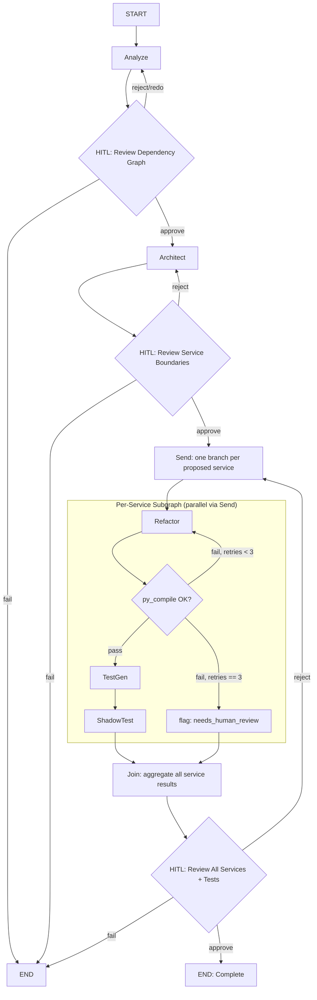

# LangGraph Redesign — Design Spec

**Date**: 2026-07-30
**Status**: Approved (design phase) — implementation plan not yet written
**Scope**: `core/orchestrator.py`, `core/constants.py` (PipelineState + related schemas), and `ARCHITECTURE_MIGRATION_IMPLEMENTATION_PLAN.md`

## Background

The project already has a working LangGraph `StateGraph` in `core/orchestrator.py`: six nodes (`analyze → architect → hitl_architect → refactor → test_gen → hitl_tests`), two HITL gates, and conditional routing on approve/reject/fail. It works but is basic:

- Refactoring and test generation run sequentially across proposed services inside a single node's Python `for` loop — no graph-native parallelism.
- `_node_test_gen` only generates tests for `state.refactoring_outputs[0]` — every service after the first is silently skipped. This is a real bug, not a design choice.
- There is no automatic validation/retry loop — if generated code fails `py_compile`, the pipeline doesn't correct itself; it depends entirely on catching an exception, appending to `state.errors`, and moving on.
- Only two human checkpoints exist (after Architect, after Test-Gen); there's no review point after Analyze.
- The root `ARCHITECTURE_MIGRATION_IMPLEMENTATION_PLAN.md` describes an aspirational cloud stack (Pinecone, Streamlit, Kubernetes, Neo4j, Redis) that was never built — the actual implementation is local-only (ChromaDB, Ollama, `rich` terminal UI). The plan document is misleading relative to the real codebase.

This spec defines a heavier redesign of the graph — self-correcting validation loops, LangGraph-native parallel fan-out per proposed microservice, a third HITL gate, and a corresponding rewrite of the plan document to match the real local-only stack.

## Goals

1. Fix the test-gen-only-covers-first-service bug as part of the redesign (not a separate patch).
2. Add an automatic, bounded retry loop so generated code that fails `py_compile` is regenerated with the error as feedback before ever reaching a human.
3. Parallelize refactor + test-gen across proposed services using LangGraph's `Send` map-reduce API, instead of a sequential Python loop.
4. Add a third HITL gate after the Analyze stage.
5. Rewrite `ARCHITECTURE_MIGRATION_IMPLEMENTATION_PLAN.md`'s architecture/tech-stack/orchestrator sections to describe the real local-only stack and the new graph design, instead of the aspirational cloud stack.

## Non-Goals (explicitly out of scope, decided during brainstorming)

- **No Critic/Reviewer agent.** Considered and declined — architecture proposals still go straight from Architect to the human HITL gate, no auto-scoring pre-filter.
- **No native LangGraph `interrupt()`/`Command(resume=...)` + checkpointer persistence.** HITL stays as the current blocking `input()` (CLI) / synchronous `ui_callback` mechanism — a single process run must complete or fail in one sitting, no pause-and-resume-later across process restarts.
- **No per-service HITL gate.** The final gate stays bundled — a human reviews all services + tests together in one checkpoint, matching today's behavior.
- **No auto-retry on Bandit security findings or shadow-test parity failures.** Only `py_compile` failures trigger the automatic retry loop. Bandit HIGH-severity findings and shadow-test mismatches are surfaced to the human at the final HITL gate, not looped automatically.
- **No rewrite of Timeline/Milestones, Resource Requirements, or Capstone Defense Outline** sections of the implementation plan — those are process content, not technical design, and stay as-is.

## Graph Topology



Three HITL gates total (up from two). Reject-routing preserves the existing feedback vocabulary (`quit`/`exit`/`stop`/`fail` in the human's feedback text → hard failure to `END`; anything else → retry the relevant stage).

## State Schema Changes

`PipelineState` (in `core/constants.py`) gains:

- `dependency_review_approved: bool` — tracks the new analyze-gate decision, mirroring how architect/test approvals are already tracked via `human_approvals`.
- A new `ServiceUnit` model replacing the flat `refactoring_outputs: List[RefactoringOutput]` / single `test_gen_output`:

  ```python
  class ServiceUnit(BaseModel):
      service: ServiceBoundary
      refactoring_output: Optional[RefactoringOutput] = None
      test_gen_output: Optional[TestGenOutput] = None
      compile_attempts: int = 0
      needs_human_review: bool = False
      status: str = "pending"  # pending | refactoring | validating | testing | done | failed
  ```

  `PipelineState.service_units: List[ServiceUnit]`

- `human_approvals` and `errors` are unchanged.

**Graph channel change (distinct from the Pydantic model):** today, every node returns `{"state": full_state}`, replacing the whole object each step. That doesn't compose with parallel `Send` branches, which run concurrently and must not race to overwrite shared state. The fan-out portion of the graph needs a reducer-backed channel — `service_units: Annotated[List[ServiceUnit], operator.add]` — so N parallel branches each return a one-item list and LangGraph merges them automatically. A `join` node then folds the merged list back into `state.service_units` on the main `PipelineState`.

## Node Mechanics

- **Fan-out**: on `hitl_architect`'s approve edge, dispatch `Send("refactor_service", {"service": s, ...})` once per entry in `architect_output.proposed_services`, replacing the current internal `for` loop inside `_node_refactor`.
- **Per-service subgraph** (`refactor` → `validate` → conditional):
  - `refactor` calls `RefactoringAgent.refactor_service()`.
  - `validate` runs `py_compile` (already available via `tools/code_generation.py`).
  - Conditional edge: while `compile_attempts < 3`, route back to `refactor` with the compile error appended as feedback context; on success, route forward to `test_gen`; on the 3rd consecutive failure, route to a terminal state that sets `needs_human_review = True` and `status = "failed"` — that one service is flagged but does not abort the others.
- **Test-Gen** runs once per successfully-validated service (this fixes the current bug where only `refactoring_outputs[0]` gets tests), producing a `TestGenOutput` per service including shadow tests.
- **Bandit / shadow-test failures are attached to the `ServiceUnit`**, not auto-retried — they're surfaced at the final HITL gate for human judgment.
- **Join**: waits for all branches to reach a terminal state (`done` or `failed`) and aggregates into `state.service_units`.

## HITL Gates & Routing

1. **After Analyze** — human reviews the dependency graph/hotspots; reject re-runs `analyze`.
2. **After Architect** — unchanged; reject re-runs `architect`.
3. **After Join** (bundled, unchanged in spirit from today) — human sees all services, their tests, any `needs_human_review` flags, and Bandit findings together; reject re-enters the fan-out stage for **all** services. Feedback text is not parsed to target individual services — this keeps the gate genuinely bundled, as decided.

## Concurrency Caveats

Stated honestly rather than glossed over, since they affect what the plan doc should claim:

- **Ollama is the likely real bottleneck.** `Send`-based fan-out makes the *graph* concurrent, but a local Ollama instance typically serializes generation requests unless `OLLAMA_NUM_PARALLEL` is configured. The plan will state that concurrency is graph-native and ready to scale, while actual wall-clock speedup depends on Ollama's parallelism configuration — not oversell it as automatic multi-service speedup.
- **`AuditLogger` / `CacheManager` (SQLite-backed) need thread-safety** once multiple branches log concurrently. `sqlite3` connections aren't safe to share across threads by default; the redesign requires either a `threading.Lock` around writes or a connection-per-thread pattern.

## Implementation Plan Doc Update

`ARCHITECTURE_MIGRATION_IMPLEMENTATION_PLAN.md` will be revised in these sections only:

- **Architecture Overview diagram** — replace with the actual local-only flow (Ollama + ChromaDB, no Pinecone/cloud services).
- **Project Structure** — align with what actually exists in the repo (drop fictional files like `supervisor_agent.py`, `embedder.py`, `git_ops.py`, `sandbox.py`, `project_db.py`, `approval_engine.py`, `project_manager.py`, `terminal.py` that were never built).
- **Orchestrator & LangGraph Workflow** section — replace with the new topology, state schema, and node mechanics described above.
- **Tech Stack** — replace cloud/enterprise entries (Pinecone/Weaviate, Streamlit, Kubernetes, Neo4j, Redis, PostgreSQL, ELK, Prometheus+Grafana) with what's actually used (ChromaDB, Ollama, DiskCache, SQLite, `rich`).

Left unchanged: Timeline/Milestones, Resource Requirements, Evaluation & Success Metrics, Risk Mitigation, Deployment Strategy, Capstone Defense Outline, References. These are process/narrative content, not technical design, and weren't part of the requested scope.

## Testing Considerations (for the eventual implementation plan)

Not designed in detail here, but worth flagging for the implementation-plan stage:
- Unit tests for the new conditional routing functions (`_route_hitl_analyze`, the per-service validate/retry router) using fake `PipelineState` fixtures, no LLM calls needed since routing is pure logic.
- An integration test that runs the graph with `skip_hitl=True` against `examples/sample_monolith/` end-to-end, asserting all services get both refactor and test-gen output (this is the regression test for the bug being fixed).
- A targeted test for the retry cap: inject a `RefactoringAgent` stub that always produces invalid code, assert it stops at exactly 3 attempts and sets `needs_human_review = True` rather than looping forever.
